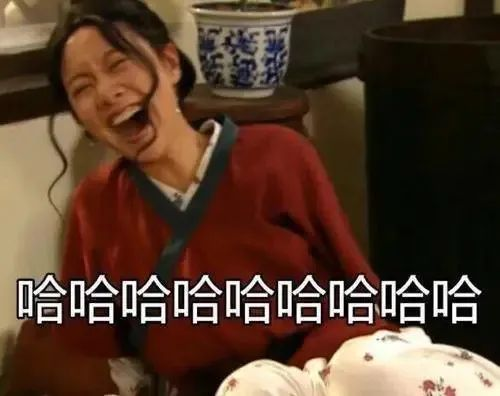
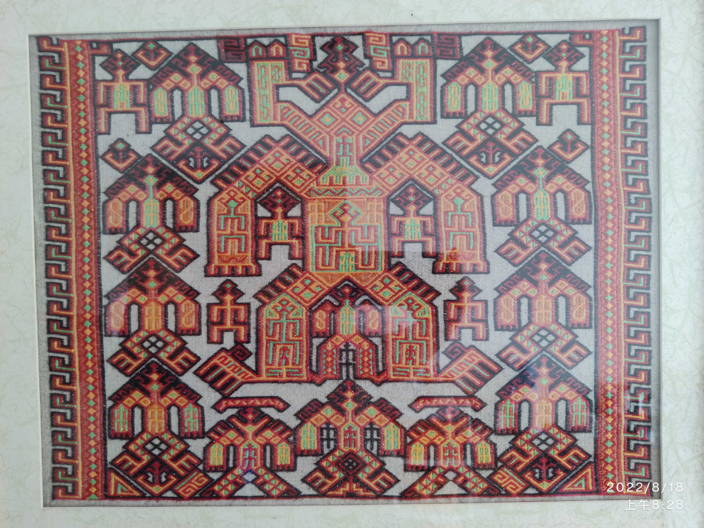
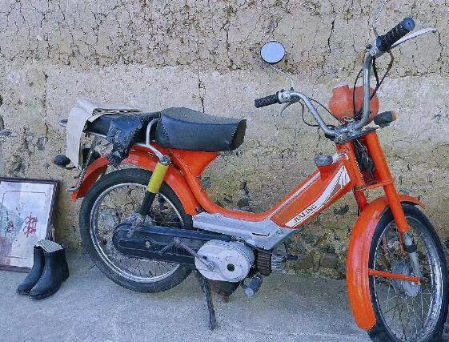
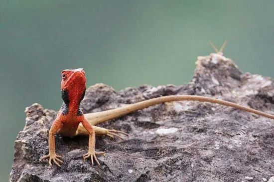

上一篇《👉 [说说最近很火的雷公马（之一）](https://mp.weixin.qq.com/s/iLFiK8NNfmIh61hz0ClFXw)》主要讲雷公马是什么，也谈到了雷公马的隐藏内涵，意在说明它不可能成为海南人的“精神铠甲”和“文化图腾”。

本文则从“精神铠甲”和“文化图腾”入手，论证海南人不需要。

## 精神铠甲

什么是铠甲？为什么需要铠甲？

铠甲是保护身体的。

当一个人穿上了精神铠甲，或者有人认为你需要精神铠甲，那么，那个被武装的人是在保护心灵。

当你穿上了铠甲，说明你遭受攻击，或者准备承受攻击，进入战斗状态。不论你因何原因穿上了铠甲，你是在保护自己，一种防御和对抗的姿态，必定存在（潜在的）攻击者。

你会天天穿着雨衣出门么？即使在没有天气预报的年代，也没有人会这么做。晴天不需要雨衣。你穿上雨衣的目的便是防雨。若是有人让你晴天穿上雨衣，你还真穿了，那肯定是你有病 —— 病入膏肓。

和平的年代，士兵卸甲归田，是不需要铠甲的。铠甲意味着敌对，意味着攻击。当有人将铠甲带到你面前，说你需要它，他便为你构建了敌人。

那么，谁在攻击海南人？有多少人在攻击？更进一步，那是地域攻击吗？又是谁在挑起岛民与游客的对立？

## 文化图腾

如果“精神铠甲”的事情让我有些生气，那“文化图腾”则是很可乐。雷公马被这二者加持，真真切切地营造了忧喜参半的氛围。

乍见雷公马被称为海南的（新）文化图腾，我内心的铠甲被笑崩了，那嘴自然也破防了：

那些海南人，可得恭喜你们了，热烈祝贺你们终于在一爬行物种那里找到了精神寄托！

我来海南也有七八年了，还真没有听说过海南人有什么文化图腾。倒是知道黎族有，是大力神，但那也只是黎族的图腾，代表不了全体海南人。

所以，对于那些鼓吹雷公马成了海南“新的“文化图腾的人，我很想先问问他们：海南“旧的”文化图腾是什么？有吗？

> 海南岛的原始居民在距今3000年前（相当于历史上的商周时期），因自然条件的变化，陆续迁移到平原、台地、河岸和海湾地带生活，从事原始农业、手工业、狩猎、捕鱼和采集活动，开创了海南岛的文明。秦末汉初原始社会开始瓦解，先从岛的北部开始，逐渐向东部、南部沿海及内地山区推移，延续时间很长。

海南人居岛几千年了，都没有一个全体认可的图腾，突然就被你们给安上一个，是不是太草率了点？问过海南人吗？

该不会是你们不知道什么是图腾吧？

> 所谓图腾，就是原始时代的人们把某种动物、植物或非生物当做自己的亲属、祖先或保护神。相信他们有一种超自然力，会保护自己和自己的族群及部落，并且还可以获得他们的力量和技能。在原始人的眼里，图腾是一个被人格化的崇拜对象。

看见没？图腾是原始社会的产物，说穿了是迷信之下的精神寄托。那时还没有科学，人们相信神，相信超自然力。

可现在是新时代了。你们居然从爬行类动物那里找到了崇拜对象 —— 我不得不承认 —— 这一番折腾出的“图腾”还挺原始的 。如若不是讽刺海南人的精神羸弱，那便是不懂文化的文化人闹了个笑话。

早先，海南人没有全体的图腾，他们那时不需要，现在就更不需要了。

海南人不需要这些东西，既不需要一个文化的图腾，也不需要精神铠甲。

因为，一个开放的、包容的、现代的自由贸易港，不需要这些劳什子。

我们应该是具备科学精神的现代人，不应该再回到原始社会搞精神崇拜；一个开放而包容的社会，人们的内心是强大的，不需要铠甲。

## 敢于自嘲的内心是强大的

为什么我认为海南人拥有强大的内心？

管中窥豹，我们可以从“雷公马”事件的起因中一探究竟。

8月6日，三亚因疫情爆发实施管控，导致8万游客被困，大批游客不能正常登机。有外地游客在机场发表“如果不是我们到海南旅游，海南人还在山上砍树”的言论，对此，有海南人自嘲回应：“我们上下班和上山都是骑雷公马”。

这里面有个梗，海南人特别懂的梗，外地人很可能不了解。

雷公马指一款小型摩托车（嘉陵CJ50），它是我国第一款民用摩托车。在上世纪90年代，海南人骑着它外出做工，上山割胶。

而雷公马又是海南人对变色树蜥的俗称（详见上一篇文章），“上下班骑雷公马”还比较和谐，但一旦说起“上山骑雷公马”就容易让人联想到树蜥（只是我个人的感受）：

试想一下你骑着它的画面 —— 是不是很魔幻？

所以，当有外地游客说，如果不是他们到海南旅游，海南人还在山上砍树。作为海南本地人，你会有什么样的回应？

如果你难以和海南人共情，那我换一个问题。

你每天辛苦上班，为公司劳心劳力，公司终于做大了，你也赚了不少钱，日子一天天好起来，从瓦房搬进了楼房。某天，你偶遇了老板的小儿子，他指着你的鼻子说：你要知道感恩，要不是我们给你机会，养着你，你还住在瓦房里！

你现在应该能体会海南人的感受了吧 —— 你会怎么回答呢？

那个回应游客的海南人，他可能会这样：那我还在瓦房里天天喝瓦罐汤。

有底气、有胸怀的人是不会和一个无知的富二代较劲的，所以，我真心为那海南人击节叫好。

这是打心底里的自信，他非常明白他的今天是怎么来的，却以一种**自嘲**的方式表现出来 —— 可不是么？没有你，我们还骑着雷公马呢。

旅游业作为海南的主要产业之一，的确为海南的经济发展做出了重大贡献。我们海南人应该坦承认这一点。但作为游客的一方，你们也须得明白，这是**等价交换**，不是你们养着我们海南人，在你们付出金钱的同时，海南给予了你优美的风光，海南人为你提供了服务。我们之间是平等的。

面对老板的小儿子，你有必要和他硬杠么？你也指着他的鼻子说：“胡扯！谁养谁呀？老子挣的每一分都是血汗钱，没有我你家公司早就倒闭了！” —— 完全没必要吗。

老板给了你工作机会，公司待你不薄，这总是事实吧，坦率地承认了这一点就行了。聪明人会点到即止。

所以，那海南人用雷公马来回应，这是**连消带打**：“消”得你无话可说，你说的我承认呀；而那“打”却又无声无息  —— 你们不来，我们不也骑着雷公马上班上山，过我们的生活么？但没有必要将这句说出来，让它藏着。当那游客慢慢回过味来，便能体会得到 —— 总有人会体会到。

## 总结与展望

从那海南人的回应中，我看见了包容与智慧，涵养与气度，在他那自嘲的笑语声中，隐藏着自信。

你说，这样的海南人还需要“精神铠甲”？

弱者才需要铠甲的防护，面对敌人才需要准备铠甲。

开放包容的自由贸易港，没有敌人 —— 更不应该制造敌人！

你来，我们欢迎；若是我们做得不好，那就改进；你们若是非难，我们一笑了之 —— 真要是有人做得过头了，不是还有法律么？为什么有人要往“地域攻击”上带？先是群起而攻，然后还满足于“庶民”的胜利？！

为什么要用“精神铠甲”在人们心底构建一个敌人？为什么要制造岛民与游客的对立氛围？

试问，那种认为是他们“养着海南”的游客又有多少呢？真要批评，批评他们就够了，而不是呼吁岛民群起对抗，甚至群起而攻 —— 安的是什么心？

其实，面对这种无理的话语，海南人并不孤单，这种滋味香港人早就体会过了。

内地人去香港买东西，认为是养着他们；而香港从深圳这边买水，那就更不得了，似乎不卖他们水，香港人就得渴死。香港人只好自嘲：可不是么，不论是买我们东西，还是卖我们东西，都是你们养着我们。

倘若海南人因此而需要“精神铠甲”，那香港人怎么办？倘若海南人因此弄出了一个爬行动物的“文化图腾”，那香港人怎么办？

在我看来，雷公马的走红，是一种畸形的文化现象。它终会成为互联网喧闹的尘埃，当前，若顺势而导，我建议：

让雷公马回归原始，成为现代人的玩偶吧。

—— 它也只可能是个玩物。若能成为旅游产品，不就挺好的么？

