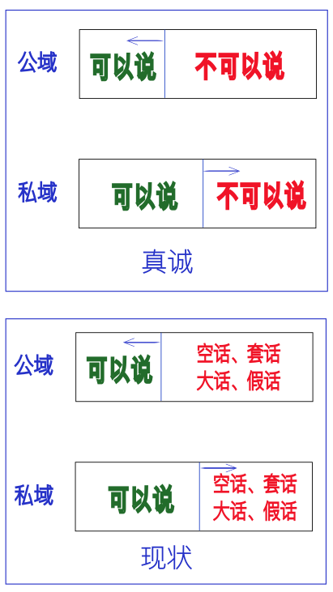

小外甥女小学毕业在即，毕业典礼将在线上举行。妹妹作为她班级的家长代表，要说几句毕业赠言。她问我有什么建议么，我回了一句：讲人话即可。

妹妹很崩溃，继而怀疑我**还**是不是她亲哥。

我说，正因为我是她亲哥，才和她讲人话，心里话。

曾几何时，我们已经不会讲人话了，也越来越不会讲真话，不会讲真诚的话 —— 尤其是站在台上、台前的时候。

似乎那一张台子、一个话筒有着扭转乾坤、颠倒黑白的魔力。都不需要镁光灯的照射，只要往台前一站，面对着麦克风，我们就能说出一堆高屋建瓴，空洞无物，但又鸡血满满的话语（抱歉，我实在不想用“正能量”这个词语）。

我有过一次糟糕的体验，至今难忘。

大约是2014年下半年，我是某厂的程序员，团队中有同事参加厂内的拓展活动。参加活动的员工来自不同的大部门，他们大多都互不相识。有个活动环节是“电话采访”，A采访B的上级主管，问几个问题。那同事提前一天和我约好了时间，第二天，我找了间会议室，电话准时打了过来，直到那时我才知道对方是谁，自然，回答问题都是即兴的。那些问题是什么，我又是如何回答的，我已经忘记了。只记得我挂掉电话的那一刹那，脸上似乎在发烧，我独自在会议室坐了一会儿，也可能坐了很久。我发现我在回答那些问题的时候，似乎变了一个人，套话连篇。如果是和一个同事私下聊天，即便是初次谋面，我也不会如此。我仿佛成了被电话线牵着的木偶，当电话铃声响起，在我按下接听键的那一刹便身不由己，像被人操纵了一样，在另一群人面前表演。要知道，那仅仅只是一根电话线呀，我并没有真的站在台上人前。

我如芒在背，很是不适。

有些人喜欢这样的表演，不论是看人表演，还是亲自下场；看人表演时他们羡慕，亲自下场时他们兴奋。

然而，我不喜欢，应该有很多人都不喜欢这种感觉。人们喜欢真诚的人，即便他们自己做不到真诚，但希望别人能真诚待他。

做真诚的人不是为了讨人喜欢，**讨人喜欢只是副作用**。真诚地说话是坦诚地对待自己的内心，借着与他人交流之机，审视自己。真诚地说是直面内心的分享，不论是情感体验，还是对生活的感受感悟。

诚然，私人交流与公开场合的发言有着很大的区别。我们不可能在一个公共场合毫无保留地讲自己的私事，但我觉得真诚是界限的问题，我们应该调整的是一根线，那根线将“可以讲的”和“不可以讲的”分开来，而不是将真话与假话分开来。

我不由得在想，我们是什么时候失去真诚的。

人类本不缺乏真诚。我们经常听见两个词：赤子之心与童言无忌。赤子指刚出生的婴儿，赤条条的，很形象，被引申为纯真善良。当婴儿成了孩童，还是保持着“有一说一”的心性，这便会触犯一些世俗的忌讳，但大人们都以他们不知忌而为之开脱，于是有了“童言无忌”。

世俗有禁忌，“忌”意味着某些东西不能说，有边界的。姑且不论其所界定的一切是否**都**合理，言论终有禁忌，然而，“不能”却会发生演变，变成“应该”。从“不能说什么”，变成“应该怎么说”。

当一个孩子看了《西游记》，知道唐僧去西天取经，就问爷爷奶奶有没有去过西天……由于“上西天”还有一个意思是“死亡”，因而这话是犯忌讳的，于是爸爸妈妈就教导孩子不能这样说，而**应该**说爷爷奶奶长命百岁，更进一步，要“福如东海，寿比南山”。一旦“应该”成了常态，我们会发现，这已经与当初的禁忌相差很远，有孙悟空一个筋斗云的距离。

即便父母教过孩子要如此“应该”，但用的场景也很有限，比如爷爷奶奶大寿、过年过节之时，平时是不会经常说的，否则，爷爷奶奶也受不了，肯定会要求孩子说人话，不能总把他们当神仙颂。

然而，学校可就不一样了。这主要体现在作文上。老师除了要教孩子字词正确的写法用法和句子的语法之外，还要求“正能量”。孩子不能写捡到一块钱，自己买棒棒糖吃了，而是要交给谁，如警察或门卫，虽然也不知道那些人收到后会怎么处理，反正不能据为己有，上交就是“正能量”；哪怕剑走偏锋，写了自己拿捡的钱买棒棒糖了，后面一定要后悔，最好是痛哭流涕，在灵魂深处反省了一番，这样也才能扭亏为盈，符合“正能量”。

有的老师也很委屈，抱怨道：不这样写，孩子作文就拿不到高分。

这件事会演变。比如学校要评优秀，某个成绩好的孩子要站在台上发言。老师肯定会在“应该”上把好关，让那些“正能量”满满的孩子脱颖而出。而榜样会在校园里形成效应。

我们不难看出，“童言无忌”的日子会很短。一旦儿童进入了学校，他学得越多，“无忌”就渐变成“大忌”，尤其是当他写作文时、写发言稿时，大忌所划下的边界远远不能满足正能量的需要，于是，孩子们朝着“应该”的方向使劲了吃奶的气力。

当他们再大一点，知道了解时事新闻了，那一个个领导和成功人士在台上慷慨激昂……那种潜移默化真的是润物无声。

那天挂下电话，我自省了片刻，但我没有答案。我不知道我为什么会那样，现如今想起了这事，才算想明白。如果你如我一般，为孩子如此可预期的未来所担忧，那我们面临着同样的问题：怎么破？

我们**应该**尽量远离那些“应该”，先守住禁忌的边界，别跑得太远。在孩子们跑得远的时候，把他们往回拉一把，告诉他们，别整天星辰大海的，多看看脚下的土地。

要想改变未来的大环境，恐怕得从孩子的作文开始，然而，这并不是问题的根本，因为学校是权力部门的意志的体现。我们可以从孩子的作文开始，但社会整体环境的整治却不是从此入手的。

在这里，我只能给出针对个体的建议：让孩子在作文里说人话，说真诚的话。先将想说的表达清楚，有条理，有逻辑，然后才是语句的修饰，少整虚头巴脑的大词。

不知你可曾听过青少年的朗诵比赛的节目？那种浮夸与矫揉造作的声音总是让我起鸡皮疙瘩，然而，更让人毛骨悚然的是，那样的孩子却能拿奖。

有大姐将之称为“朗诵音”，我觉得很贴切 —— 其实质就是，一旦话筒在手，便不会讲人话了。

这种奖，不要也罢。

