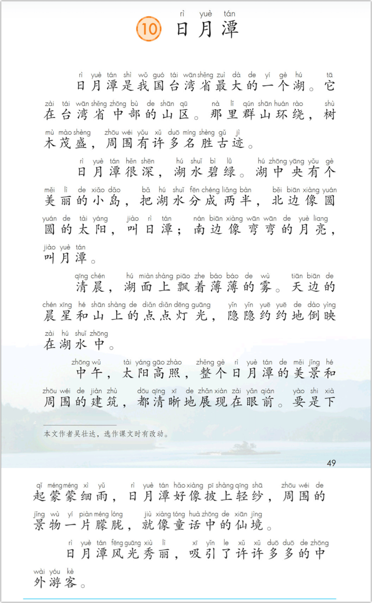

前不久的一天，我接儿子放学，他一脸的不开心，就问他怎么了，答：被体育老师罚抄课文了。

我简直不相信耳朵！就条件反射式地确认：“体育老师？罚抄课文？”

在再次得到肯定的回答以后，我还是觉得难以置信，继而产生啼笑皆非的荒唐感，就让儿子详细说说怎么回事。原来那堂体育课没上室外课，而是在教室里面看视频。儿子喜欢讲话，看视频时就更忍不住，于是就被体育老师惩罚了。

对于老师的行为，我没有给出评判，而是好奇：“抄你们体育教材上的课文吗？”在我的印象中，他们好像有一本薄薄的体育教材。

“不是的。抄的是语文。”

我就更好奇了。按说，体育老师应该罚抄体育科目的，没想到抄的居然是语文 —— 语文课本上那么多篇文章，不知体育老师选的是哪一篇？我就继续追问。

“黄继光。这篇文章还挺长的。”

“那你抄完了吗？”

“没有。后来下课了，我就没抄了。”

我没再说什么，心想这孩子还不算傻，就呵呵地不了了之。

我不由得想起人们常用来调侃他人的表达：“你数学是体育老师教的？”、“你英语是体育老师教的？” ……诸如此类。也不知体育老师招惹谁了，好像他们定然不擅长教这些科目似的。显然事实并非如此，至少，我娃的体育老师是例外，他就会教语文，其惩罚学生的方式正是很多语文老师所擅长的。我也因此多了一种调侃儿子的方式 —— 如果他未来能成为书法家的话：多亏了体育老师罚你抄课文。

你看，连体育老师都知道，抄写课文这种写字的方式是对学生的惩罚。既然是惩罚，那自然不是好事。倘若一个学生没有犯错，凭什么让学生大段大段地抄写课文？还不乏老师动不动就让孩子们整篇地抄写。

这种教学行为定然会被那些老师合理化，甚至会被美化：都是为了学生好。比如，这篇课文是必考的；再比如，学生可以记住知识点……

说到记忆，就不能不谈到背诵课文的事 —— 这是一件越来越让我深恶痛绝的教学要求。如果说那厌恶榜上“练习笔顺”只能屈居第二，那“背诵课文”绝对是第一名。

我越发想不明白的是，背诵那课文干嘛？除了在试卷上完形填空，还能有什么用？

—— 倘若一名校长要求教师必须将教学大纲背诵下来才能上课，或者是将学校的规章制度背诵下来才能上岗，我估计这校长得被老师们的唾沫星子给淹了。

其实，老师们不妨反思一下，你小时候背诵过的那些课文还记得几篇，而你记忆中尚存的寥寥数篇（多数只可能是诗歌）对你的生活与工作又有什么意义？

在以前，我们能背诵记忆一些东西，那还是有意义的，因为那时的图书期刊主要在图书馆和书店，倘若你不记得某些知识，而在工作中又需要用到它（比如写一篇文章），你查资料的时间精力成本会很大。但现在不同了，只要打开一个联网的浏览器，或者是几本电子书籍，你就能获得详细的资料，完全可以足不出户。

所以，我认为背诵课文的教学要求依然是前一篇说过的“刻舟求剑”：**在纸张泛滥的时代执着于在竹简上练字**。

有老师肯定要说，那学生学什么呢？总得记住一些东西吧，不然作文怎么写？ 巧妇难为无米之炊！

我认为好的文章，学生们自然会记住一些东西。再者，文章经过老师的讲解，学生们会从文本中感受到更多的东西。至于哪些东西会留存在学生的脑海中，这首先会有个体差异的，同样的课堂，不同学生所领会的东西必定会有差异；其次，还取决于老师对文章诠释的精彩程度，老师的课越是精彩，学生被调动得越专注投入，所领会到的东西也就越多。

当一个老师察觉到学生们记住的东西很少时，他们往往会走上让孩子背诵的道路 —— 记不住是吗？那给我背！一遍不行，再来一遍；还不行？再来……

由此可见，让学生背诵课文往往是老师在无计可施时的“杀手锏”，老师想以此解决孩子的知识留存率低的问题，殊不知，这种解决方案往往会变成要求孩子“死记硬背”，它是拙劣的，拔苗助长式的。它会折磨学生，尤其是那些记忆力差的学生，会摧毁他们的自信心，打击他们学习的兴趣。

倘若一篇文章好，学生们能流利朗读不就行了吗？那些好的文章，能唤起孩子思想的文章，必定会在他们心中留存，这不就很好了吗？再说了，咱们的先人早就言过：“熟读唐诗三百首，不会作诗也会吟” —— 既然“熟读”就能让“不会作诗”的“也会吟”，那基层的老师何必给学生的课（层）文（层）加码？

退一步来说，即使学生折腾了一番，会背诵课文了，那又能怎样呢？难不成是为了防备以后领导问及课文的事，好背给他听？

显然，**逐句记住课文是无意义的**，它绝不是语文教学的初衷。这就要谈及我们语文教学的目的：什么是语文？到底要教什么？

这两个关键问题，我会在后续用专门的篇幅来探讨。特别地，我会从ChatGPT切入，讨论那些原本就要在语文教学中重点训练的东西，现如今，它们变得越发重要了。

最后，再讲个儿子背诵课文的故事以结尾。

那是两年前的一个中午，儿子回家时拿着语文书，说是《日月潭》的课文不会背，只好中午拿回家练习。我在他的门外听了会儿，看他吞吞吐吐的很吃力，决定干预一下，帮帮他，就走进去拿起课本看了两遍，然后背给他听。

我的记忆力不好，但也背得八九不离十，有两三处与原文略有出入，儿子随口将我纠正。其实，文章的句子他已经读得很熟练了，但没法将前后连贯起来。

我没有讲背诵的事，而是带着他分析了文章，也正是那次，儿子第一次接触到了“逻辑结构”这个词。文章背后有一根线，你得先找到它，然后抓住它。

我问的**第一个问题**是：如果让你来写一篇介绍海南岛或者你们学校的文章，**你会怎么写**？

你是不是先得介绍它在哪里，然后简单介绍下总体的情况，接着再详细展开了讲？这篇文章也是这样的。

先来看第一段。由于“潭”不像“岛”或者“学校”那样常见，你们不了解“潭”，因此这里的第一句说的是“什么是潭”，潭就是湖。然后第二句就是介绍日月潭在哪里；第三句讲的是她的周边环境，属于简介概况。

第二段讲解的是“日月潭”名字的由来 —— “为什么叫日月潭”，是因为她具备了这样的特征。

由于文章的主题是介绍日月潭的风光的，那么，在介绍她的基本情况之后，我们就要讲她美在何处，怎么个美法。文章是分时段介绍的。这里我给儿子提出了**第二个问题**：通常，我们将一天中分成三个时段“早晨、中午、傍晚”，但作者只提及了“清晨、中午”，为什么不提及傍晚或夜里的景色？这种问题促使了他思考，同时，问题本身也加深了他的印象：原来文章只提及了两个时段的景色。背诵时的思路就更清晰了。

文章的最后一段是一句话，是对全文的总结。文章的逻辑结构是“总、分、总”。开始说的是，日月潭是什么，在哪里，她周边的情况如何；接着讲她名字的由来；然后是分两个时段介绍自然风景；最后是一句总结，也从游客多的侧面映衬她的风光之美。

当儿子了解了文章的构成逻辑，几分钟之后，他便能将文章背诵下来 —— 他自然很高兴。

在那以后，我时常和他提及这篇文章。在我看来，这篇文章就是一篇模板，足以将小学的作文训练包圆了。若不知道文章如何写，那就想想《日月潭》。比如，“总分总”的套路是“万能的”；比如作者时间段的取舍；再比如，其中所暗含的“是什么”与“为什么”，以及作者从自然与人的角度来论证。

前不久，由于某事，我又想起了这篇文章，遂问儿子，还能背诵《日月潭》吗？他已经忘记了。果然，背诵课文没啥鸟用。

在我看来，背诵课文是低劣的教学要求，这绝是一个误区，它不会是语文教学的重点，更不可能是它的目标。哪怕是要求学生用自己的话来**转述课文**，都要比背诵好上千百倍。

