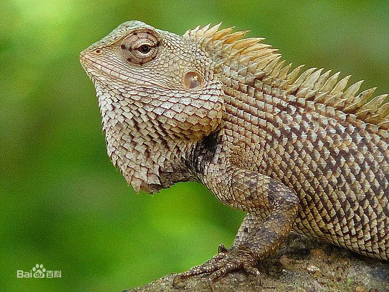
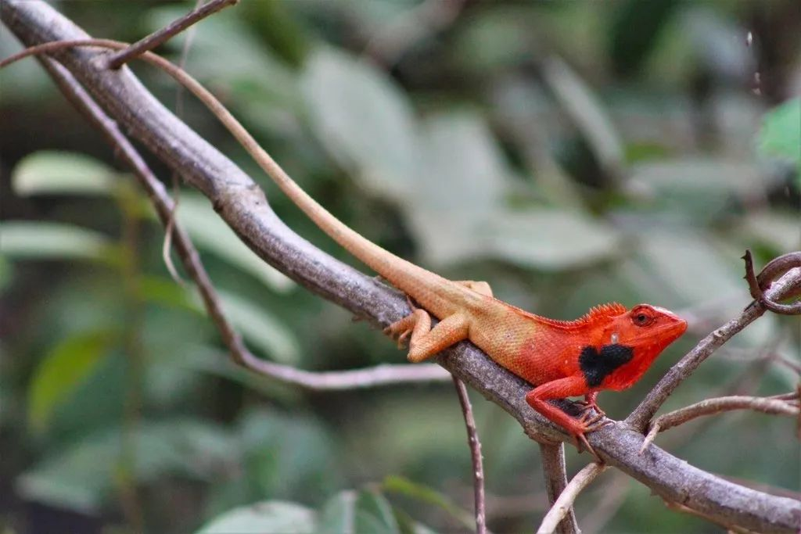

最近，海南的“雷公马”很火。

一开始，我没把它当回事，哪怕是有（自）媒体以“地域攻击”为基调大肆渲染，我也觉得就是一阵风。哪知，随着官方的加持，“雷公马”的卡通形象不但被纳入了宣传体系，还成了给海南居民做核酸认证的贴标；特别是昨天，在海南广播电视总台“海南新闻联播”的视频号中，一个小女孩用她那稚嫩的声音喊“今天做核酸，可以领取雷公马贴贴了”，让我很是触动。我不由得好好地审视这件事。

“雷公马”是海南人对一种**变色树蜥**的俗称。

> 《广东通志》：
>
> 琼州有雷公马，状如蜥蜴，腹紫，背青绿，头颈有鬉，如马，多在树上。

相传它是雷公的坐骑，因其头部像马，便被称为“雷公马”。

它还有一个称谓，叫“雷公狗”。顾名思义，它是雷公这神仙所豢养的家犬。这不免让人想到二郎神，可二郎神养的是真狗，叫“哮天犬”，一听名字就觉得很拉风。

雷公养只变色树蜥，不论是当狗看家护院，还是骑着它上下班，多少让人觉得磕碜了些。但从另一个角度来审视，天宫的这一安排着实令人叫绝。既然雷公的级别到了，那就少不了专车，也应该给他弄个看家的。再瞧这变色蜥蜴，**出能当骑**，**入能护院**，不知是哪位主事的大仙大手一挥，拍了个板，将之发给了雷公，**可谓一举两得**；这不但**解决了雷公的标配**，还**为天庭省下一笔开支**，又是**一举两得**。

一箭三雕、一石三鸟已经让人拍案叫绝了，但这一举四得，是真正的神来之笔。

海南民间还有这样的传说，一旦被这树蜥咬到，天不打雷它是不松口的。这时你千万别唱“天不刮风天不下雨天上有太阳”，因为晴天霹雳是极小概率事件，你要唱：“雨一直下～～气氛不算融洽……”

所以，出门在外，不但要注意脚下的小动物，那歌也不能乱唱的。

可万一被咬到了，怎么办？

诸位请听题：这时，它是“雷公马”，还是“雷公狗”？

绝大多数人会答“狗”吧。

马不咬人的，但狗会。而且，这狗一旦咬上谁也是很难松口的，但若是主人喝止，那它也会乖乖地松开。

你会发现，若以流传于民间的传说的匹配度而论，叫这树蜥“雷公狗”会更合适，但是，这咬人可不是什么好事，不是正面形象。而马是温顺的，更有亲和力，所以，我们今天在市面上见到的，便是雷公马，而不是雷公狗了。

但请记住那传说，**千万别被这变色蜥蜴的温顺名字所蒙蔽，它一体两面，一旦被它咬住，只有它的主人可以喝止**。

这树蜥本是只变换肤色，但在神域，却是连功能也可以变 —— 要不，怎么说它是“神物”呢？

有人可能会说，这“可爱的”雷公马，怎么到你笔下却成了这样子呢？

—— 不是我改变了它的样子。

雷公马的民间传说，我的解读虽有演绎，但主要逻辑应该没什么问题，关键是，人家哮天犬还能找到一些英雄事迹，白龙马也驮着唐僧去了趟西天，那取经的事它即使没功劳也有苦劳的，但这雷公的标配都干嘛了？不论是与狗比，还是与马比，它都毫无亮点 —— 似乎只有“咬人不松口，很听主人话”这两项特长了。

不妨再来看看它实际的样子。

上文的图片来自百度百科，是特写，这让它看起来大而壮实，很像只鳄鱼，似乎雷公骑上它也很拉风。其实不然。一睹全貌你就会觉得雷神被忽悠了，就连弼马温都可以嘲笑他。

所以，当有人说，这“雷公马”是海南人的“精神铠甲”；还有人说，雷公马是海南的“文化图腾” —— 我是无比的困惑。

若论铠甲的坚实，那真不如选鳄鱼呢，鳄鱼那身鳞皮即使做不了铠甲，还能做个包包，整双皮鞋；而说到文化图腾，你有见过有哪个民族将**变色龙**一样的东西做图腾吗？

我真的很不明白，这是有多误会雷公马，又或者，是误会了海南人？

后续我再好好掰扯掰扯这“精神铠甲”与“文化图腾”的事。还有，在雷公马事件起初，海南人所展现出的**自嘲能力**，我也得好好地夸上一夸。

