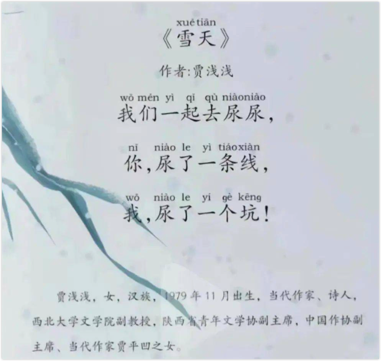
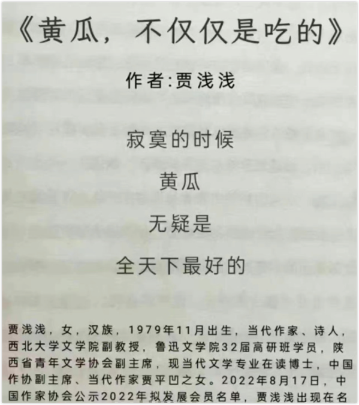
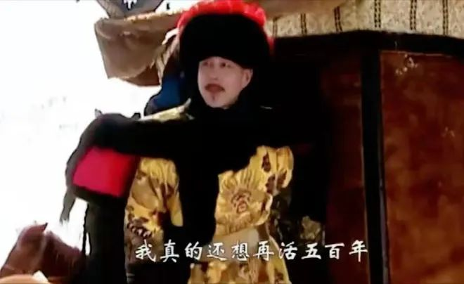

2022年8月17日下午，中国作家协会公示了2022年**会员发展名单**，拟发展会员994人。著名作家贾平凹之女**贾浅浅**赫然在列。贾浅浅再次被推上了风口浪尖。

上一次是在2021年2月，贾浅浅可谓一夜成名，她的一些诗作被翻了出来，被众人讥讽嘲弄。我也是其中的一员（👉 [文化篇：一图说尽这国事](https://mp.weixin.qq.com/s/fUMWi3R_v2nTklgnXKeVRg)）。

与上次不同，这次也有一些人支持贾浅浅，他们找出了贾浅浅的另一些诗作，大意是说，要评价她是否够格入中国作协，也得看看她的其他作品，而不是抓住几首屎尿屁的不放。也有人说，即使写的是屎尿屁，那也是作者的表达自由。还有人说，你可以批评她的作品，而不应该人身攻击。

说得都很有道理。

我突然想起了一个演讲，演讲者提醒大家不要盲目从众，她特别强调：当一个人被千夫所指时，**你一定要警惕**，不要立即加入声讨者的阵营，至少要看看他说了什么。

第一次，贾浅浅没有公开回应。第二次，到现在还没有。

贾浅浅没有回应吗？其实也不是。她的能力如何，够不够资格入中国作协，是要靠作品说话的，而她的作品一直就在，在默默地发声 —— 就看你是否有兴趣看了。

昨天，有人转发贾浅浅的其他诗作（👉 [浅浅自选诗十五首||我常常独自黯然神伤](https://mp.weixin.qq.com/s/envbRwmY0QAncrzLcWbgsw)），确实比那广为流传的几首好多了。

我不由得**自省**：在评论一件事情之前，我是否掌握了**足够的信息**？特别是评判一个人的时候，我是否因为了解片面而**带有偏见**？

这也让我重新审视这事。当然，我并不是试图为贾浅浅翻案，一个吃瓜喝粥的犯不着为吃燕窝鲍鱼的操心。我感兴趣的是，**人们为什么如此反感？**

有人将这归结于“反三俗”、“追求‘正能量’”、“一切都要高大上”的艺术品味引导的成功，是社会舆论风气所致，这当然很有启发。但若将贾浅浅那些饱受争议的作品换一下作者，人们还会如此么？

这首《雪天》，若是出自孩童之手，会不会因为童趣十足而博得满堂彩？

再比如这首《黄瓜，不仅仅是吃的》：

若是余秀华所写，骂的人会不会少很多？（肯定也会有人骂，本就有一些人骂余秀华）

—— 为什么贾浅浅写就不行？

主要有两点。

首先，人们的要求不一样。

孩童与余秀华都是弱者，一个年幼，一个身残。人们会对他们宽容很多。贾浅浅作为著名作家的女儿，又是博士，还是大学副教授，那期望值不可同日而语。

其次，人们反感的是官僚集团。

人们很容易这么想：一个写屎尿屁的人有什么资格入作协，而且还是国家级的，还不是靠她老子？贾浅浅的事很容易勾起大众对官僚集团的痛恨。江西周公子的事屡见不鲜，也不遥远。所以，并不是人们多恨贾浅浅，她不过是人们移情的对象，人们恨的是官僚集团。

贾浅浅是不是沾了她父亲的光？这就见仁见智了 —— 既难证实，也无法证伪。

我认为她不公开回应是明智的，否则，会再次激起人们的怒火。  有意思的是，贾浅浅这是第二次“走红”，经过去年那一轮之后，她依然要进中国作家协会，是对自己的实力相当有信心，还是觉得那风头已过，没有料到今天的局面？

这让我想起了某个演员，他在微博上秀自己的博士学位还嫌不过瘾，非要弄个学霸的人设出来，结果牵扯出一堆造假的事。毛掉了一地， 凤凰成了裸鸡。何必非要享“齐人之福”，将好处占尽呢？

一个中国作家协会的头衔就那么重要么？这恐怕是我辈难以理解的事。

或许，贾浅浅真的是实力所致，倘若不入这作协，那是国家的损失；又或者，这是所有“还想再活五百年”者的宿命吧。

