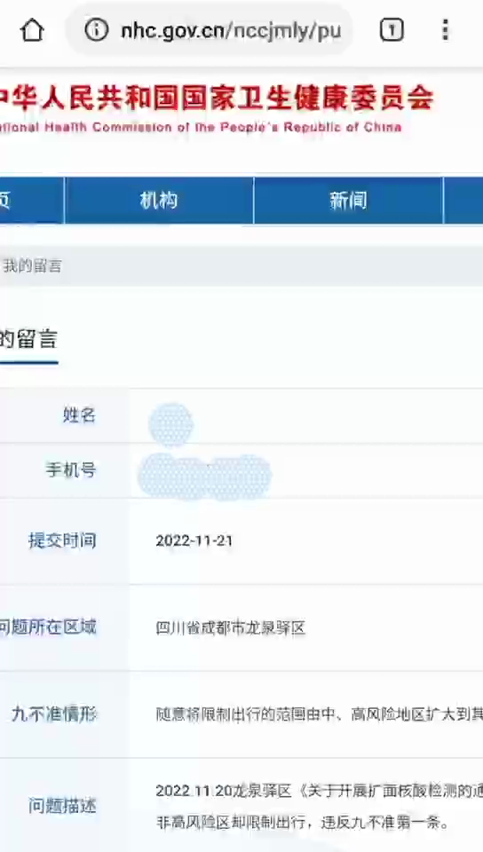
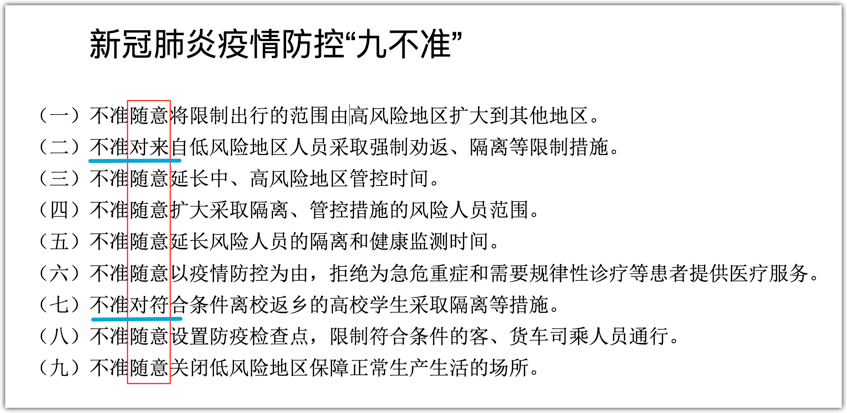
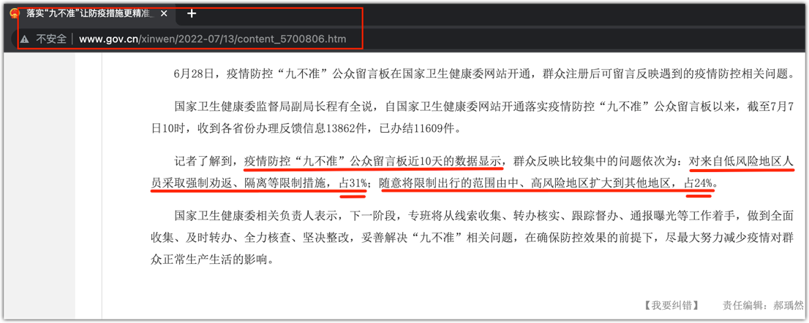
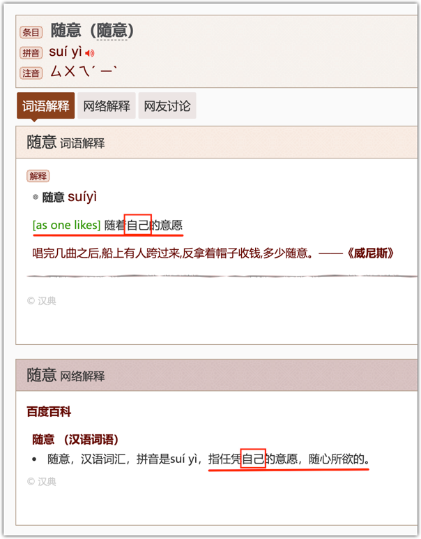

昨天（11月26日），有一则通话录音广为流传。

有一成都龙泉驿区的男性市民投诉当地疫情防控部门，指出官方违犯了国务院联防联控机制疫情防控所公布的“九不准”的第一条，责任部门是一名女性给出了答复，双方在电话中就是否违犯了“一不准”展开了辩论：

> 一、不准随意将限制出行的范围由中、高风险地区扩大到其他地区

先简单介绍一下这条“一不准”的由来。

2022年6月5日，在国务院联防联控机制的新闻发布会上，国家卫健委疾控局副局长、一级巡视员 雷正龙 公布了“九不准”，要求各地更加高效统筹疫情防控和经济社会发展，进一步提高防控措施的科学性、精准性、针对性，坚决防止简单化、一刀切和层层加码等现象，坚决做到“九不准”。

2022年11月12日，在国务院联防联控机制的新闻发布会上，国家疾控局副局长 常继乐 公布了二十条优化措施（简称“二十条”），其中第四条指出：

> （四）将风险区由“高、中、低”三类调整为“高、低”两类，最大限度减少管控人员。原则上将感染者居住地以及活动频繁且疫情传播风险较高的工作地和活动地等区域划定为高风险区，高风险区一般以单元、楼栋为单位划定，不得随意扩大；高风险区所在县（市、区、旗）的其他地区划定为低风险区。高风险区连续5天未发现新增感染者，降为低风险区。符合解封条件的高风险区要及时解封。

根据这优化措施的第四条，『将风险区由“高、中、低”三类调整为“高、低”两类』，那么，“九不准”的第一条就成了：

> 一、不准随意将限制出行的范围由高风险地区扩大到其他地区。

在官民双方的交流中，对“一不准”的条文是没有争议的，比如，不存在“中风险”之类的讨论，也就是说，这次辩论的**辩题是明确的**。

双方唇枪舌战，很是激烈。作为辩论爱好者，我听得大呼过瘾。特别是男选手，牢牢抓住关键点，不论女选手怎么带节奏，他都岿然不动，总是一击而中，多次让女选手理屈词穷、哑口无言。在我看来，男选手是**以碾压的方式完胜**的，也给我狠狠地上了一课。

本文是个人的学习与反思之旅。为了行文方便，特别女官员在其中一个回合中提及“这个我们就不辩论了吧”，下文便以分析、学习这场辩论的方式进行。

辩题：成都龙泉驿区疫情防控责任部门是否违犯了“九不准”的第一条（“不准随意将限制出行的范围由高风险地区扩大到其他地区”）

正方（男市民）：违犯了
反方（女官员）：没有违犯

在这场辩论当中，一开始双方虽然交锋激烈，但都很克制，不出恶声。但在讨论对“随意”的理解时，反方女选手没有把持住了，她让男选手“你可以问下语文老师”，这立即得到了男选手的回呛：“你去问语文老师，好吧？”总体说来，这一环节虽然语气不善，有些出格，但与国内整个舆论以及讨论氛围相比，还是显得文明的，我还是要给双方点赞的。

这一激烈冲突也意味着这里**有争议** —— 如果将反方之前的哑口无言理解为服气，那么，在“随意”的理解上，反方是不服气的，她不认为自己败了，而是对方语文没学好。

既然反、正双方都认为对方的“语文”没有学好，那么，到底是谁需要补课呢？这也是我关注的重点。

争议点：“不准随意将限制出行的范围由高风险地区扩大到其他地区” 之 “随意” 的理解。

反方认为：我们不是“随意”扩大范围，我们有专家研判，而且是上级专家的研判。她的意思是，我们“不随意”，是科学的、有根据的，扩大限制区域是合理的、正当的。

正方认为：“随意”是个贬义词，它是修饰“扩大”的，指的是这种扩大的行为要不得；如果你认为扩大是有根据的，那么，每一个扩大的人都会说他们是有依据的，这个“不准”就失去了意义。

我不知道听众（或读者）您是怎么理解的？

乍听之下，我耳目一新。确切的说法是，耳朵一新，眼睛一亮。

—— 原来是这样！！

在以前，我一直活在反方的圈套里。当然，从两人的交流来看，我不认为女选手是故意设圈套，而是她自己也一直被套住。

既然反方认为是原因在于语文没有学好，我们的分析也就从此入手。先分析这“一不准”：

> 一、不准随意将限制出行的范围由高风险地区扩大到其他地区。

不知你有没有发现，单看这个句子，它是少了成分的。咱们从最简单的句式来撸一遍：

1. 不准【谁】…扩大…
2. 不准【谁】…将…扩大到…
3. 不准【谁】随意将…扩大到…
4. 不准【谁】随意将**限制…出行的范围**由**高风险地区**扩大到到其他地区

这就像很多口号一样，比如，“为人民服务” —— 【谁】为人民服务？在主语没有明确之前，这是不确定的：可能会出现你以为的**服务提供方**和别人以为的不一致。

所以，从语法上来说，既然讨论这一句（它也是辩题），首先便得将句子的“主谓宾”补足了。

可以明确的一点是，不论这个【谁】是谁，他必然是实施“扩大”这一行为的人（或其他主体，比如责任部门）。

再来看他扩大的是什么？是“限制公民出行的范围”。本来，只有高风险区才可以限制公民的出行，现在，有人将这个范围扩大了。

所以，我们可以得出结论：这个句子的主体，那个【谁】便是**颁布并实施**在非高风险地区限制公民出行规则的**责任部门**。

显然，这种行为是国家所不准许的，而这条“一不准”便是针对这些责任部门的：你们不可以这么干！ —— 这也是国务院联防联控机制一再强调，要坚决杜绝的。

要想在非高风险区限制人的出行，要怎么干才是正当的？

其实，正方选手对此是有过论证说明的：要想扩大限制区域，重新划定高风险区即可。

道理很简单：既然你们理由这么充足，想限制某区域的人出行，那就应将该区域划定为高风险区，而按照现行的防控政策，在高风险区限制公民出现是正当的 —— 你们为什么不划定呢？只有一个解释，按现行防控标准，那些地方不够高风险地区的标准！否则，你们怎么可能放着现成的桥不走，非要摸石头过河呢？所以，你们就是违犯了“九不准”的第一条。

除重新划定高风险区外，其他限制公民出行的疫情防控措施都是“随意”的，哪怕你的“研判”依据来自上级专家（管他什么专家） —— 恰如正方男选手所言，“随意”就是贬义词 —— 既然上级专家这么厉害，认为一个非高风险地区也需要限制公民的出行，那他比国家级的专家更厉害吗？（当然，也不能完全排除这种情况）但是，恰如正方男选手所言，那你们（或上级专家）也应该向国家卫健委反映，说这“九不准”不准，应付不了当前的疫情防控，需要修改……但在此之前，你们就是违犯了国家防控政策，违犯了一不准，需要改正。

反方选手认为他们不是“随意”，是有“上级专家研判”的，殊不知，这种回复是站不住脚的，不合逻辑的。

正方就曾一针见血地指出，任何人都可以说他做的某项决策不是随意的。如果以“不是随意”便可以违背“不准”，那任何人都可以来一句“姐不是随意的人”，然后为所欲为。

由此可见，其实正方已经将逻辑讲清楚了，但反方却没有听懂，而是将双方的分歧或冲突归结于“语文”的问题。

当反方选手让正方选手去学学语文时，其实已经昭示着她在这一轮又是完败 —— 这是语文的问题吗？

虽然句子结构分析对语文有要求，但找出“不准”所针对的责任主体，以及这一系列的分析与推理，却是逻辑思维能力在起主导作用。它不仅仅是语文的问题，或者说，语文不是主要的，逻辑才是。

在此之前的一个回合，反方曾提及，若正方在非高风险区没按照他们限制出行要求做，进而引起疫情传播……正方都来了个抢答：那我也没有责任 —— 我没有违犯国家防控政策，那就不用承担传播疫情的后果。其实，这一回合的辩论，已经完美展示了反方的“随意”行为：如果她“因可能而导致的后果，当事人需要承担额外的责任”的逻辑能够成立，那我们可以将任何一个人禁锢在家中，比如，司机开车出门就可能撞到人。

我们再来看一个可能对反方有利的证据。这不是他们辩论时反方提及的，而是我在写这篇文章查找资料时注意到的。作为一个思辨爱好者，不应忽视对任何一方有利的证据。

我们来看“九不准”的其他“不准”：

你会发现，这9条里面有7条写的是“不准随意”，而第2、7两条则是直接写的“不准”，没有“随意”二字。

反方可能要说，若真如正方所言，“随意”只是贬义词，而作为规则的条款，是不必要写出来的，反而像第2、7条那样就已经非常明确。因此，反方会以2、7条的存在**反证**来其他7条之中的“随意”不是贬义词 —— 只要他们是经过论证后的“研判”，那就可以干。

这时候，正方依然可以用之前的论证回应（已经足够），但我相信反方依然会不服。

这时，正方可以从“九不准”为什么会出台，以及这每一条的意义来入手分析。

之所以出现这“九不准”，显然是因为地方上频繁违犯，引起大量的民众不满，有的甚至付出了惨痛的代价，所以，国务院联防联控机制才颁布了这九条 —— 不是八不准，也不是十不准。特别是为什么不凑个整十呢？我认为这些“不准”的出台是数据支撑的。当然，我能查到的是“九不准”颁布后的数据：

位居投诉榜首的恰恰是“九不准”的前两条，只不过顺序稍微颠倒了一下。

> 一、不准随意将限制出行的范围由高风险地区扩大到其他地区。（投诉占比24%）
> 二、不准对来自低风险地区人员采取强制劝返、隔离等限制措施。（投诉占比31%）

我相信反方依然会有疑问，这两条恰好一个有了“随意”二字，一个没有，他们会认为这说明不了什么。

9条中7条有“随意”，说明这种随意行为特别多；而第2、7条“不准”没有“随意”二字，却是因为两条是非常明确的，地方管理者也缺少“随意”的空间：

> 二、不准对来自低风险地区人员采取强制劝返、隔离等限制措施。
> 七、不准对符合条件离校返乡的高校学生采取隔离等措施。

将这两条放在一起比较，你会发现它俩很相似，不同的是第7条有明确针对的群体。这两条其实是可以合并为一条的，估计因为“不准”出台的时间点上的特殊性，才将学生单独列出来强调（时值6月初，学生即将放暑假）。一个人是否来自低风险地区，这是非常明确的，行程码是有体现的 —— 你总不能“随意”说他经过了高风险地区。

你再看其他的条目，关于限制出行的地区、关于封控时间的长短、关于风险人员的范围（连时空伴随都出现过）等等，是不是就给一些管理者很大的“随意”空间？

那男市民的投诉，不也是针对这种“随意”吗？

如果反方依旧不服气 —— 好吧，那我只好谈谈语文了：咱们不妨拿起词典，先查查“随意”是什么意思？

请注意这词语解释里的“自己”。这个“自己”指谁呢？显然，相对于发布“九不准”命令的国务院联防联控机制，地方各级政府就是被针对的。我们将“随意”的解释代入“一不准”，并将缺失的部分补全：

> 地方各级政府，不准你们任凭**自己的**意愿，将限制公民出行的范围由高风险地区扩大到其他地区。

这下应该很清楚了吗：反方完败。也希望如正方在通话结束时所言，希望官方能尽快改正过来。

最后，我还想说一点是，涉及政策，特别是法规之类的条款确实不应搞出这种“随意”、“恶意”的表达。比如，若将“随意”换成“恶意”，那地方加码者肯定会说他们是善意的，也只有拥有强大逻辑思维能力的市民才能反驳了。

> 不准恶意将限制出行的范围由高风险地区扩大到其他地区。

只写“不准”二字反而更简单明了：

> 不准将限制出行的范围由高风险地区扩大到其他地区。

毕竟，**大多数国人都缺乏逻辑思维能力**，像这位成都男性市民，他所展现的思辨能力，在即时交流中反应迅速，处处一针见血，总是一击而中，我是很少见到的。

