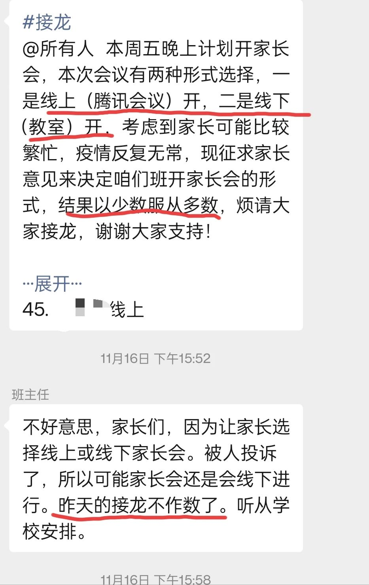
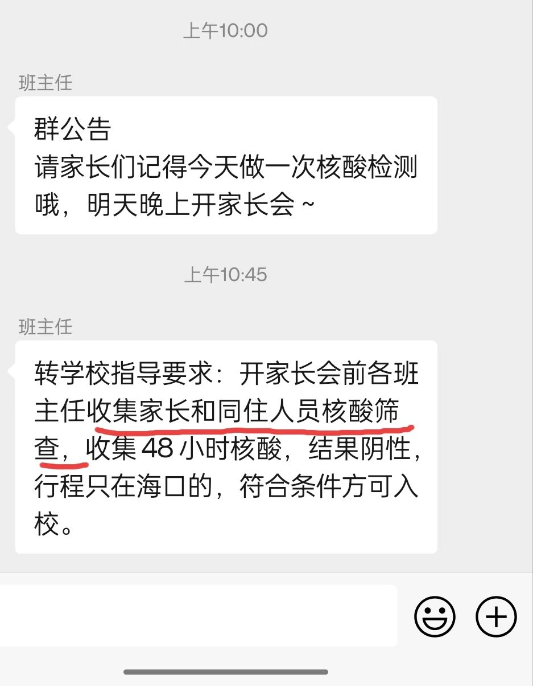

只看这标题，诸君定会以为我经常投诉学校。这绝对是误解。

我儿子上四年级。这四年来我就投诉过学校一次，还记录在以前的文章中。之所以用这个标题，是因为这次我原本是想投诉来着，但后来改了主意。

事情的起因是学校要开家长会。

上周，班主任先在群内发起了投票活动，让家长们选择家长会的举办形式：是线上（通过腾讯视频会议），还是线下（在娃的教室开）？

我觉得这投票的事是多此一举，学校完全可以决定举行线上家长会。

疫情以前的家长会，都是去娃的教室；疫情之后，一开始搞的还是线下，后来转为线上。

线下还是挺麻烦的，又是签名登记、量体温、扫码，又是戴口罩的；关键是家长会也就是听老师讲PPT，没有家长与老师的互动，所以，将家长们齐聚一堂听老师台上广播，实在没什么必要，因为这除了和老师面对面之外，和观看线上的视频没有任何区别。而一旦双方的互动丧失，直播都没有必要，家长只用看老师录制好的视频即可。老师不用在指定的时间跑场（有的任课老师教多个班级），家长更不必在指定的时间观看，双方都有很高的选择自由度。所以，我觉得这种线下的家长会完全没有必要，正当我想给学校提建议时，后面转为线上开，我觉得挺好的。

如今的家长会缺乏老师和家长的互动，我也能理解。因为时代变了，沟通的手段更便捷、及时且高效。若孩子在学校有什么异常，老师和家长在微信上就能及时沟通解决，根本毋须等到家长会上再交流。**家长会更像是一个历史的产物，它已经失去原发动力，现在只不过是沿着其既有的惯性朝前滑行**。一方面，出于历史原因，学校需要组织家长会，否则显得学校不重视与家长的沟通，老师只好借此谈谈班级整体的情况，而很多家长对此并不大关心，他们关注的是个体 —— 自己的孩子；另一方面，家长们又不得不参加家长会，若不参加，似乎又表示了自己对孩子的成长漠不关心……所以，双方都被一种无形的东西裹挟，不得不应付。

人们慢慢发现，举办家长会成了形式主义。就像很多会议意义一样，它空洞无物。

鉴于以上的原因，我是提倡取消家长会的，但我知道，对很多人来说（不论是学校还是家长），这是一件难以接受的事情。退而求其次的话，我认为线上家长会是很好的选择，它也可以起到过渡的作用，为未来取消家长会做准备。

所以，当班主任说让家长投票决定举办家长会的形式，我觉得没有必要，学校定线上的不就行了吗，又不是没搞过？

但看见通知上的措辞“少数服从多数”，我想大概是有人对此不满，需要用民主的方式来进行决断……这也是好事吗，对家长们的意愿进行一下摸底也挺好的，于是我便第一个接龙，选择了“线上”。

哪知，在第45个家长接龙选择“线上”后，班主任叫停了，说有家长投诉了学校这种投票行为，之前的接龙投票不作数了，家长会到底怎么开还须待定。

—— 简直匪夷所思！

我便问老师那（些）投诉的家长想咋样？老师说，投诉者想参加线下家长会。

我儿子班上50来号学生，还有双胞胎之类的孩子4人，45个已投票的家长全部选了“线上”，这可能代表着与学生对应的家长票数实际为47票 —— 甚至更多，因为有家长可能还没来得及投票便被叫停。由于是全年级的家长投票，那投诉者不一定是儿子班上的家长，但不论怎样，这个班级的投票数已经反映了问题，估计其他班级也差不多。但现在的情况却是，因为某个或几个家长的投诉，绝大部分家长的意愿就可以忽略了？

有家长也觉得这很荒唐，表示那也要投诉回去。

班主任老师在群内安抚大家，说家长会到底如何开，学校目前还没有定，也不一定就是线下。但事后的结果证明，我担心的事情终是发生了—— 家长会改成了线下！

我认为学校应该雄起的。如果这点事情都搞不定，那领导也太没有决断力了。且不说家长会已经成了鸡肋、成了折腾老师和家长的形式主义的温床 —— 我们完全可以抛开这些不谈，仅凭中国搞得如火如荼的防疫现状，开线上家长会的理由已经足够充分了！

—— 既然都是对着家长读PPT，为什么非要强迫家长聚齐一堂收听广播？特别是在那么多家长不愿意举行线下家长会的情况下。

我尽量尝试去理解他人，但一次又一次地被现实扇了耳光，这次又是狠狠的一记 —— 我真是理解不了那（些）投诉的家长！

我并不觉得“少数服从多数”一定就是正当的，但是，在家长会的举办形式上，还是极具操作性的，那些少数服从了多数的家长并不曾丧失他们想线下的权利：若是某个或某几个家长想与老师当面交流，完全可以和老师约时间，我想老师是不会拒绝的。现在的情况却是，**因为极少数家长的不同意见，绝大多数的家长却被裹挟了**。

我原打算学校若是宣布搞线下家长会，我便再次投诉，看看学校会不会翻烙饼。但真到了班主任老师宣告时，群内鸦雀无声 —— 我也不想投诉了，尤其是看到班主任提醒家长们做好核酸：

对于当初那些投诉学校想搞线下家长会的人，可谓“求仁得仁”：你们这么想线下，那就核酸你全家。

是的，我反水了，这一次我没有投诉学校 —— 我非常支持与拥护学校的决定。

当然，我知道，我理想中的、**仅有那些投诉者参加的家长会**的情形是不会发生的。大多数人都是温顺的绵羊，他们任随其他人折腾，哪怕折腾他们的只是一小撮，他们也逆来顺受。

至于我，自是没兴趣陪他们一起折腾，遂与老师说了一声，不参加这次线下家长会了。

