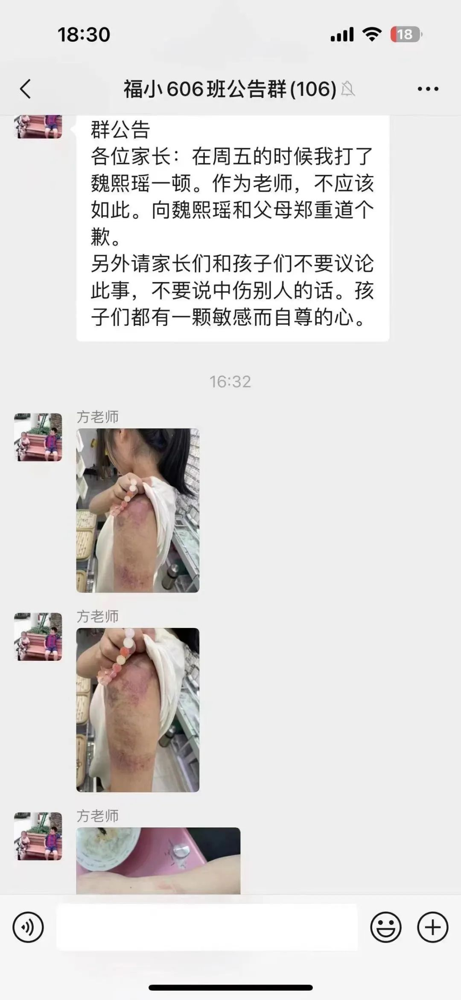
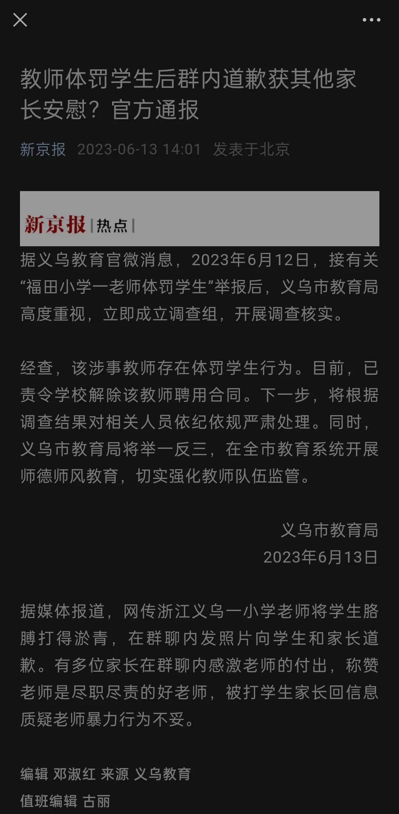
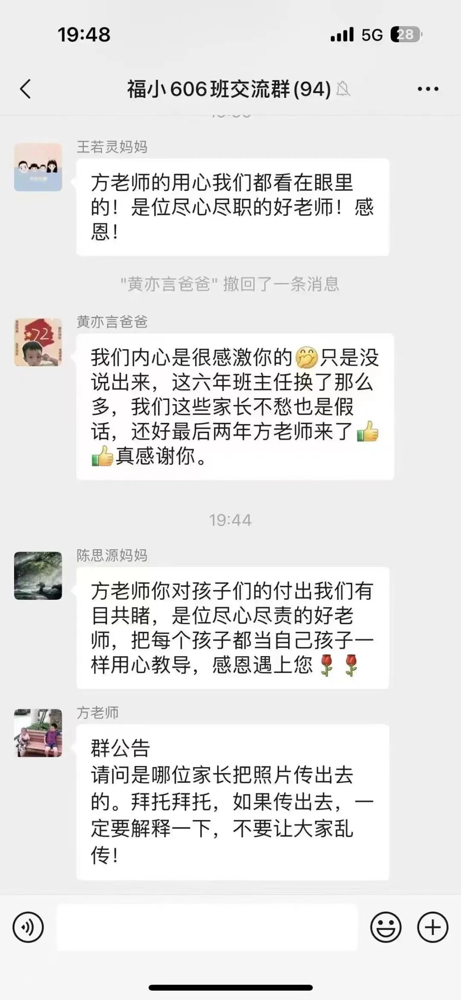
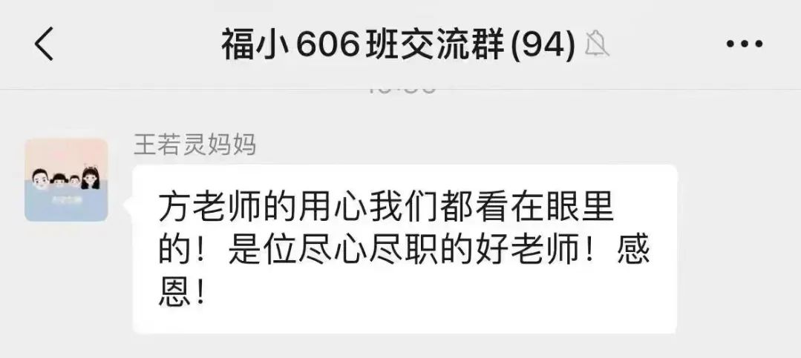
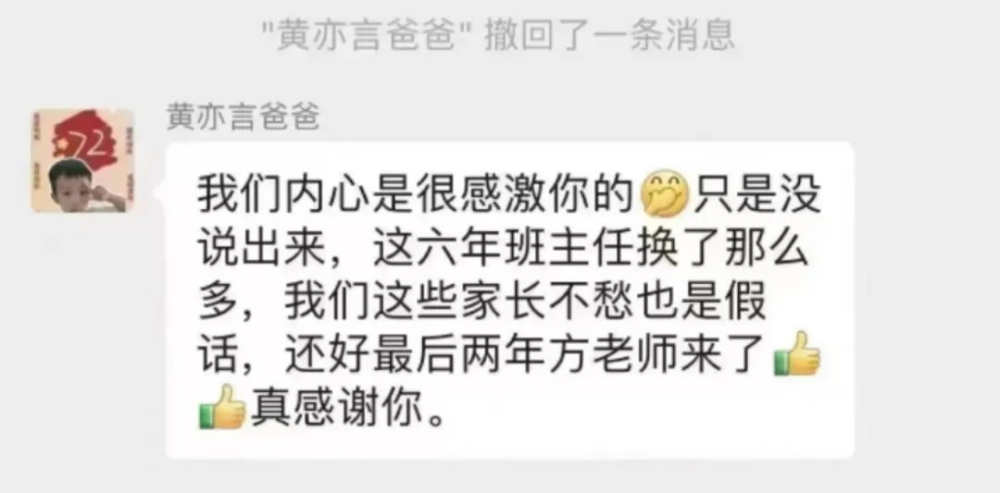
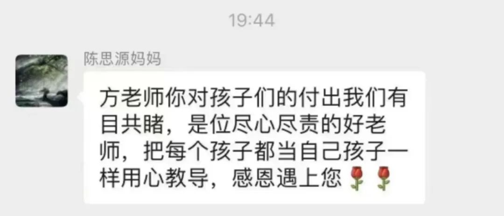
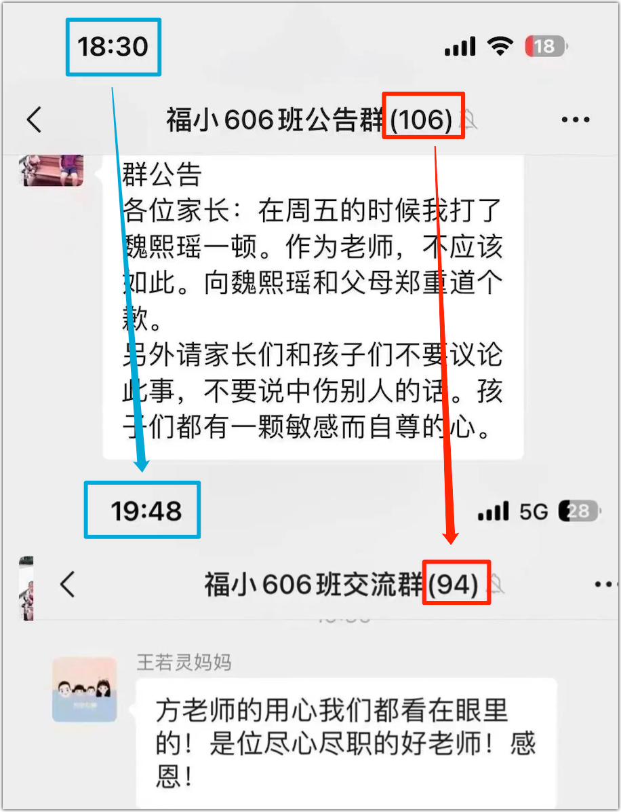

近日，浙江省义乌市一所小学的老师对学生施暴，其班级微信群的两张截图在网络上流传。先来看第一张：

这事已经实锤。**义乌市教育局**已经责令**福田小学**解除**方老师**的合同，并表示在调查：

对学生施暴的老师，我们时而看见，着实令人愤慨，但这起事件最让人不耻的还是三个同学的家长：

这样的家长着实该谴责。比如，他们没有同理心，不是打在自家孩子身上就感受不到痛，咱们还可以搬出老祖宗的“幼吾幼以及人之幼”来教训他们；也正是这种家长对老师的跪舔，才助长了这种教育之恶。

本文也就不炒现饭了，我想回到文字本身，以这有限的图文作为阅读材料，解读这家长和老师互动，从这些文字中一窥他们的内心。（这也是我们学习语文的目的之一）

先来看这方老师：

> 群公告
>
> 各位家长：在周五的时候我打了魏熙瑶一顿。作为老师，不应该如此。向魏熙瑶和父母郑重道个歉。
> 另外请家长们和孩子们不要议论此事，不要说中伤别人的话。孩子们都有一颗敏感而自尊的心。

这是一则群公告。这意味着，方老师希望群内所有的人都看到，“各位家长”则明确了说话的对象。

“在周五的时候我打了魏熙瑶一顿”，我特不理解这句，因为方老师连一个字的解释都没有。难道不是事出有因吗？总不能莫名其妙地打魏同学一顿吧？又或者是，打了就打了，都懒得解释了？

也存在一种可能，魏同学的家长在方老师发公告之前有过交涉，方老师就在公告中承认了“打过”这一事实。但如果这种猜测不成立，那将是一件极其可怕的事：方老师懒得解释，而这，正是权力的任性 —— 对于“凭什么打孩子？”的问题，受害者的家属连个说法都没有！

若以通常的人性去揣度，方老师都搞到要向他人公开道歉的程度，那自是免不了要为自己辩解或开脱一番，所以，解释的话语是不应该省的，但这里偏偏就是省了。因此，除了懒得解释以外，还有另一种可能：打孩子的原因实在拿不上台面。比如，瞅孩子不顺眼又或者是她在不该笑的时候笑了（只是假设）……这种缘由自是拿不上台面的。

因此，仅就缺失解释而言，这已经是一份不合格的公告了。一句话就显现了老师的水平。

接下来，方老师说：“向魏熙瑶和父母郑重道个歉”，我不知道读者朋友们怎么看，我总觉得这方老师写错了。正确的表达有这两种可能：

1. 向魏熙瑶和**她的**父母郑重道个歉
2. 向魏熙瑶**的**父母郑重道个歉

若是第一种，道歉对象也包括孩子，那前面的“各位家长”的称谓就有问题了，应该改为“魏熙瑶同学以及各位家长”；若是第二种，那将“和”字改为“的”是很有必要的，因为这不是向方老师的父母道歉，而是魏同学的，这个定语是不能省的，但凡改过病句的人都知道。

哪一种可能性较大，我说点个人看法：我认为应该取第一种，毕竟，对孩子的伤害是首当其冲的，必须先向孩子道歉，但以我对方老师的揣测，第二种的可能性更大。

有人可能觉得我在抠字眼，但我想说的是，如果方老师是语文老师，那她的职业素养恐怕是很差劲的；即便方老师不是语文老师，那他的表达能力也令人堪忧，我很怀疑他能否把课讲准确，讲明白。

好吧，就算以上是抠字眼行了吧 —— 有些人会说，不管方老师向谁道歉，他总是认识到不应该，也表达了道歉的意思，但真的是这样吗？

我估计很多人没有意识到：**这句话是没有主语的**。

1. 在周五的时候我打了魏熙瑶一顿。
2. 作为老师，不应该如此。
3. 向魏熙瑶和父母郑重道个歉。

请注意，这三句话都是以句号结束。也就是说，它们是独立成句的，但除了第一句有主语，后两句都没有！补齐之后，应该是这样的：

1. 在周五的时候我打了魏熙瑶一顿。
2. 作为老师，**我**不应该如此。
3. **我**向魏熙瑶和她的父母郑重道个歉。

有意思的是第2句，一旦省略了“我”，它还可以理解成对第1句的评价，这时，意思就有所变化：作为老师，以从事这个职业而言，不应该如此，而不是强调“我”不应该如此。

其实，不论是否意识到主语被省略，你只需将两个版本各读一遍，就会感觉到，有主语的表达会让人觉得更真诚一些。

我相信，方老师不是刻意省略主语的，但正是这种无意识却将他的内心暴露出来。这在心理学上是有解释的：当一个人想逃避责任时，他就会不自觉地将主语“我”省略掉；而当他想承担的时候，比如为了彰显自己的努力与付出，他会一口一个“我”：“同志们，想当初，**我**上刀山，**我**下火海，正是**我**舍得孩子才套住了狼啊……”

所以，从这些文字当中，我感受不到方老师道歉的诚意，相反，他很可能是迫于一点仅存的道德压力，认为将孩子打成了那样，不道歉的话没法向众人交代，因此就敷衍潦草，连打孩子的原因都没有提及，道歉也就是应付一下，走走过场。

这公告的最后两句，是方老师说的最操蛋的话（请读者原谅我的脏话）：“另外请家长们和孩子们不要议论此事，不要说中伤别人的话。孩子们都有一颗敏感而自尊的心。”对此，我是很无语的，因为 —— 太无耻了！！！

只许州官放火，不许百姓点灯；精神分裂……总之，你会有很多话想说，但都被堵在了胸口，到最后，却只想骂人。

只要是一个稍具社会洞察力的人，都会觉得这一幕很熟悉，它就是社会的缩影。一些受害者讨不到说法，没有人给他们说法，于是，受害者或其家人为了鸣冤，又或者是旁观者出于义愤，将施害者的恶行公之于世，这时，那施害者或者本应主持公道的人却跑出来说，你们别传这些图片和视频呀，这会对受害者和家属造成二次伤害……

方老师想封别人的口，“请家长们和孩子们不要议论此事”，所给出的理由却是因为“孩子们都有一颗敏感而自尊的心”！原来方老师也知道啊！怎么动手时您就将孩子们“敏感而自尊”忘了个精光呢？？感情这些话都是用来拿捏别人的？

所以，当这种操作出自一个老师之手时，还是小学老师，我除了想骂人，真的是词穷了。

对于方老师的操作，我还有一处不解，那就是孩子的伤情照片是他传上来的，而且跟在群公告之后。也就是说，这也是他想广而告之的。

按说，一个人干了坏事，他是不想让人知道的。这种广而告之是什么意思呢？

一种可能是，方老师认为这不算什么，那是发给其他家长看的：你们看，也没将孩子打得怎么样吗，就是胳膊淤青了点，过两天就好了。

另一种可能是杀鸡儆猴，依然是针对其他家长：你们给我看好了啊，都给我乖乖的，否则，下次就是你们的孩子，而让我打了也是白打，大不了像上面那样道个歉完事。

哪种可能性较大，还是兼而有之，不同人的判断有别，也应该有其他的解读吧，只是我的想象力有限，就留给诸位看官了。

其实，即使没有以上的分析，我们也能够感知到很多东西，比如，方老师的扭曲人格，不真诚的道歉，等等。

然而，所有这些，那三位旁观的家长就是感受不到，相反，他们忙不迭地感起恩来。面对这种情景，不知为何，咱们孔祖师爷的名言“三人行，必有我师”就这么冒出来了，也算另类解释吧 —— 你们三人真行，终于找到了方老师！

其实，怯于强权也是人之常情，毕竟软肋在人家在手上，旁观者若是不敢挺身而出，不能仗义执言，我们多少也有些理解，但至少可以沉默呀，实在没有必要在这时候站出来感恩。通常，这第一个站出来的人是要下很大决心的。

这黄姓家长一直找不到机会感恩，“内心是很感激”，“只是没说出来”，现在别的孩子被暴打了，他可算逮到机会了！

当看到义乌市教育局责令**福田小学**解除**方老师**的合同的消息时，我就替这位黄姓家长着急，他好容易盼来了一位好老师，这下又泡汤了。按说，这么好的方老师，黄姓家长应该去教育局给他申个冤、拉个横幅什么的 —— 要是觉得势单力薄了，可以将另两位女家长也捎上：一起拼个车吧，男的就多担待点，当个好司机。

这位陈姓家长就更有意思了，她怎么知道方老师在家常打孩子，还打得特别用心，胳膊淤青？

三个家长，一个说“我们都看在眼里”，一个说“我们有目共睹”，另一个说“我们内心是很感激你的” —— 发现没？这仨都说的是“我们”，总想着代表别人，可是，就这【**眼瞎心盲**】的孬样，怎么能代表别人？谁又想被他们代表？

我惊喜地看到，在这两张截图之间，已经有12人（106-94）离开了群聊：

他们是自己退群，还是被踢的，我不得而知。但在我看来，不与邪恶苟且，不与跪舔的奴才为伍，就是好样的。

也只有这样的人多了，中国的教育才有希望，这个民族才有希望！

