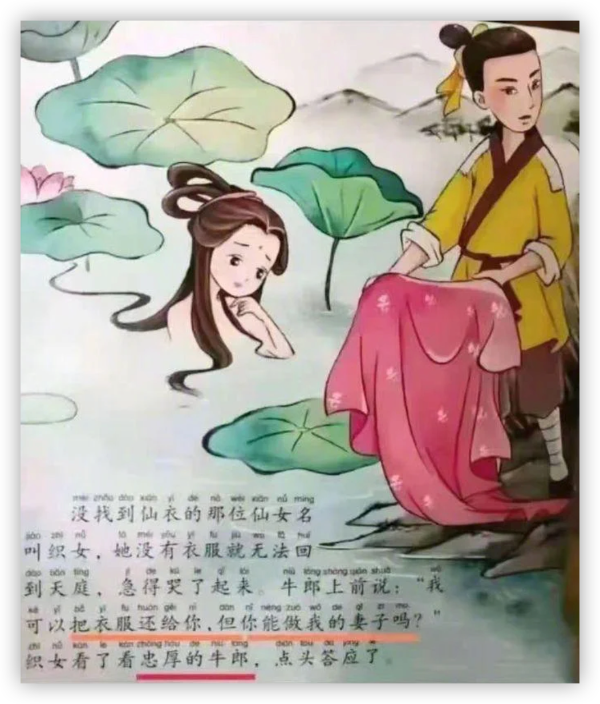
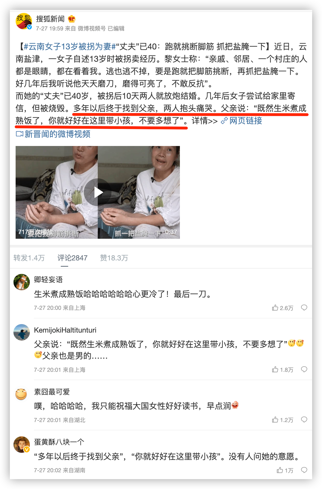
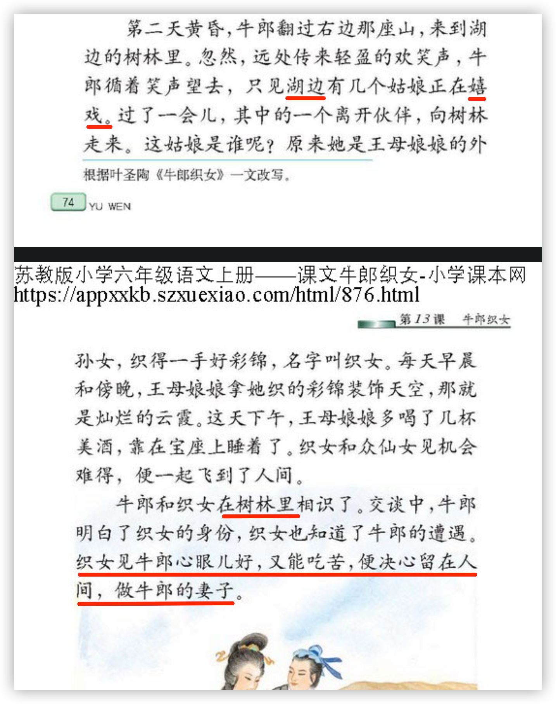
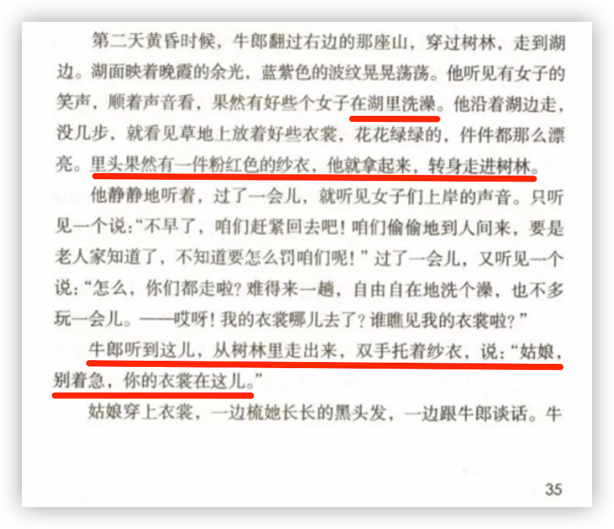
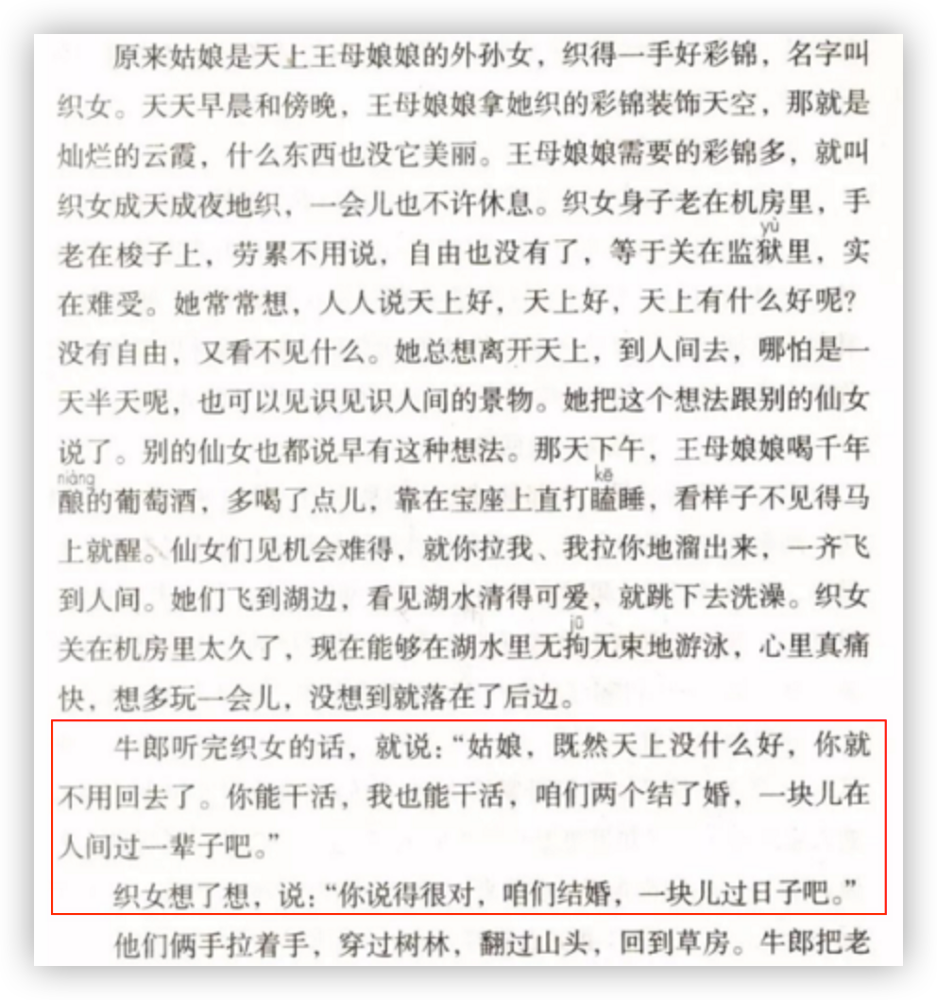
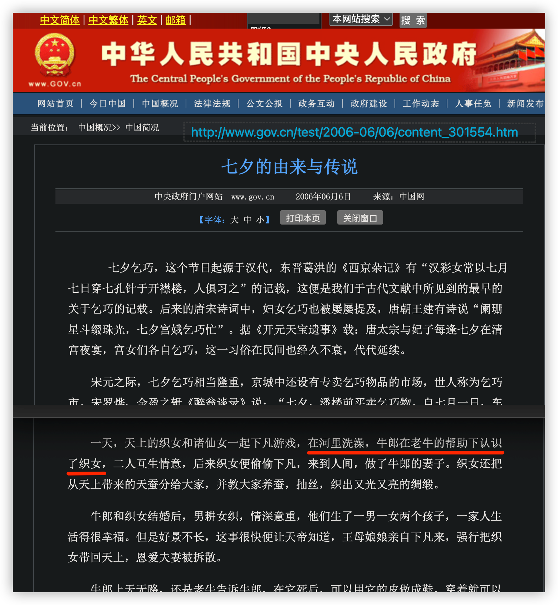

今天七夕。

牛郎织女的故事早就被很多人批判过了。

我换个方式讲这“牛郎织女”的故事，你便能明白人们批判什么：

一个偷窥女生洗澡的男青年，他盗窃了女生的衣物，以此胁迫女生嫁他为妻，并最终得逞。该女生为他生下了一儿一女。女生的外祖母终得到女生的消息，于是派人解救，得以成功。哪知这男青年还穷追不舍，一直追到了女生的家乡。

这男青年还将他们的一双儿女装在筐里，挑着他们来到女生的外祖母面前，试图用孩子来感动老人。未果。男青年继而痛斥老人拆散他们家庭，让幼小儿女从此无母。这彻底激怒了那外祖母，因为那青年当初胁迫她外孙女的时候，也是拆散了她们。那外祖母就地挖下一条深深的沟渠，引入河水，以此阻隔那男青年，避免外孙女再次受到伤害。

可能有人会问，那河上不是还建了一座桥吗？

站在那男青年的角度来讲这故事，确实得有一座桥。这桥有两层意思：

1. 他的事迹感天动地，最终得逞了；
2. 他太苦了，一年只得见娇妻一次。

但是，在我讲述的版本里是真没有 —— 换做你是那女生的家人，你会为那“忠厚的牛郎”建一座桥？

也只能说我这故事里没有。因为现实中有的父母是连河沟都不会挖的。他们反而会将女儿留下，还劝女儿不要多想，让她今后就和那流氓无赖好好地过日子，因为生米已经煮成了熟饭。

我查了一下牛郎织女传说的由来。

有一篇《牛郎织女》讲得比较详细。扫下面二维码码可读全文。

作者罗列了不同的版本，比如，小学五、六年级的教材（苏教版和人教版），还有《民国老教材》中的《织女星和牵牛星》等等。以下为文章的摘录与链接：

> 中国的七夕节由星宿崇拜演化而来，最早可能追溯至东周的春秋战国时期。星宿拟人化 ，后来在民间传说过程中逐渐扩充成一场悲剧故事：喜欢聚众喝酒的王母娘娘又醉倒了 ，年幼的织女无人看管，偷偷跟着其他仙女一起下凡洗澡，牛郎趁机偷了她的衣服藏起来。仙女们发现偷窥、夺衣的牛郎后惊骇逃去，织女一个人落在了最后，到处寻找自己的衣服。牛郎拿出衣服，以道德、名誉（加武力？）胁迫绑架织女做了自己的妻子。牛郎把织女的登天羽翼藏了起来，非法拘禁了织女，还强暴织女后生下孩子。后来牛郎织女分开了，具体原因和过程主要有两种版本（可参见漆凌云的考证）：一种版本是织女设法索回仙衣后逃回了天庭，另一种版本是王母娘娘解救了织女。织女每年和自己的孩子及其父亲在七月初七那天见一次，这就成了七夕节的来历。近年来，由于商家的加持，七夕节成了中国热闹的情人节。
>
> https://blog.sciencenet.cn/home.php?mod=space&uid=674842&do=blog&id=1327220

我特别关注孩子的教材。有意思的是苏教版和人教版都改编自叶圣陶的《牛郎织女》，但两版的差别较大。

苏教版里面压根儿就没有织女在河里洗澡的情节，她是在湖边的树林里嬉戏。至于两人如何相识，那是一笔带过。这个版本强调了织女是自愿的，因为她觉得“牛郎心眼儿好，又能吃苦，便决心留在人间，做牛郎的妻子” —— 至于牛郎有没有求婚，我们是不知道的。整体来看，这个版本是逻辑自洽的。牛郎不但没有让人诟病的劣迹，而是有优点，因此织女看上了他。

而在人教版里，织女洗澡、牛郎偷衣的情节是保留的：

在这个版本里，牛郎有求婚，而织女被说服。但令人匪夷所思的是，一个女生在河里洗澡，衣服不见了，突然出来一个男的，说姑娘别急，衣服在这儿呢。那女生居然若无其事地穿上衣服，还一边梳头，一边与那陌生男子谈话聊天。这真的很神话 —— 哪怕这织女不是仙人，我们也应该惊为天人。

所以，若论**故事的逻辑性**，这人教与苏教两个版本的PK，**人教是完败**。当然，若论改编谁更**忠于原著**，恐怕则是**人教完胜**吧。不过，以**对孩子的毒害更轻**而言，我肯定是要挺苏教的。

更有意思的还得看政府网站的官方版本：

“天上的织女和诸仙女一起下凡游戏，在河里洗澡，牛郎在老牛的帮助下认识了织女，二人互生情意”。

一个女生在河里洗澡，一个男生要如何做才能认识她呢？不知道。反正是一个中间人帮忙的。

这就叫一笔带过。读者你不必关心过程，只要知道结果就够了。牛郎有没有偷窥、偷衣服，老牛是媒人、皮条客，还是人贩子，都无所谓，总之，两人“互生情意”，这结果相当美好。

忽略关键过程，让故事变得美好。可能这是讲好一个故事的“要义”。

只是，我不喜欢。

