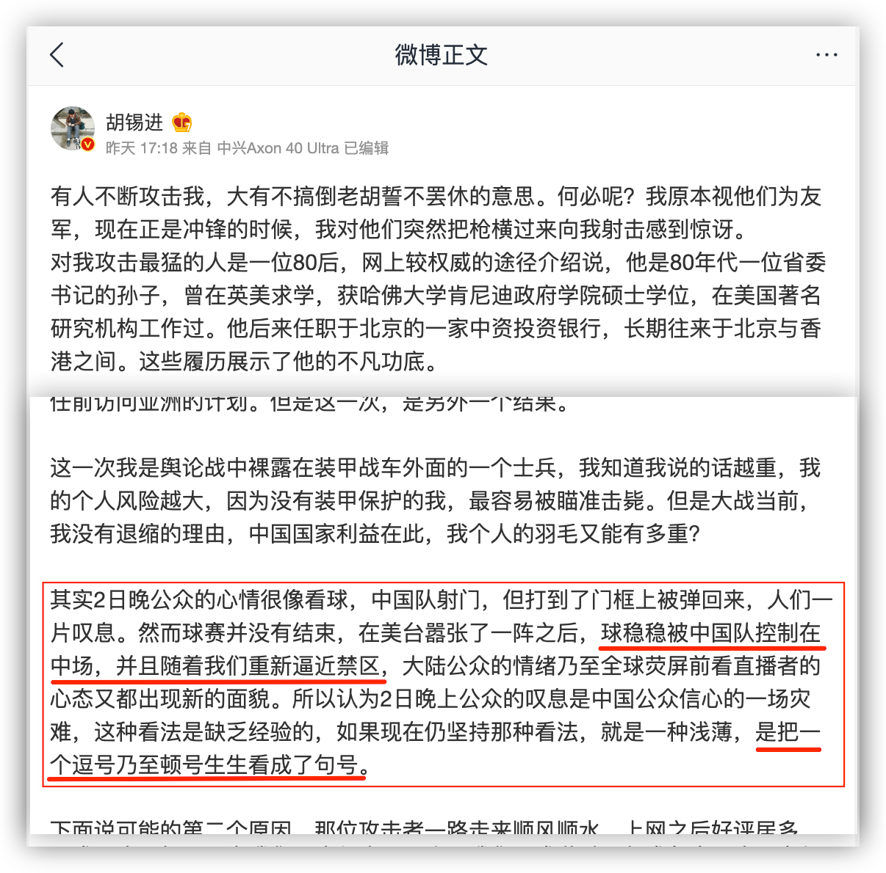
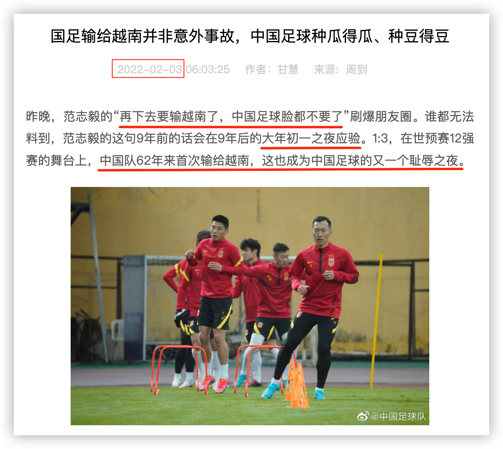

2022年8月4日傍晚，“复杂中国”的报道者**胡锡进**发了一条微博：

红线框高亮的那段让我瞠目结舌：他这到底是在夸中国，还是在贬损中国呢？

现如今的中国队，你什么时候见过“球稳稳被中国队控制在中场，并且随着我们重新逼近禁区”？

咱也不能说得那么绝对 —— 你见过多少这样的场景？即使偶尔某场比赛中国队灵光乍现，那也就几十秒，可以算个逗号；更甚至于只有几秒，那就只能是个顿号了；而最终的句号是什么，就不必我多说了吧，相信今年大年初一的事胡编没有忘记。

所以，你胡锡进是什么意思？如果不是憋着坏地用中国足球队来丑化我泱泱大国，那就得老老实实地承认自己犯了个大错：**类比不当**。

“不当类比”是一种非形式谬误，系使用不恰当的类比推论而得出不恰当的结论。它还有一些别称：错误类比（false analogy）、牵强比附、牵强类比、不当类比、或弱类比（weak analogy）。

犯了这种谬误的人借由比较两件不同事物在某些方面的共同点，来推论这两件不同事物在另外一些方面也必然相同。其具体的推论形式为：因为X和Y在a、b、c方面相同，所以X和Y在p、q、r方面也必定相同。

胡锡进本想用“射门却打在了门框”来类比观众的叹息，这个确实很好，也是X与Y两件事情上的共同点，但他往下演绎就不是那么回事了，因为中国队赢不了球。当然，这说的都是中国男足。如果胡锡进硬要说这“中国队”是指“中国女子足球队”，那我得承认这类比在字面是恰当的，但是，难道他胡家的利益被人侵犯了，胡编却指望着他家的女人出头吗？所以，倘若胡锡进如此狡辩，那球依旧是打在了门框上。

不当类比也是大众常犯的逻辑谬误之一。

比如说爱国这事，很多人经常利用“子不嫌母丑“来攻击那个”嫌弃者“，不让他们抱怨。这便是不当类比。

要知道，母丑是先天的，如果子女不帮她整容，这是无法改变的（这句谚语出现之初，人类还无法整容）。也就是说，母丑无法改变，这是这一俗语的前提。**但国家却是可以改变的**。攻击者便是利用不当类比将人们所抱怨的问题**转化为道德问题**，从而占据道德高地实施攻击，**让抱怨者闭嘴**。不懂得识别这一逻辑谬误的人，便会被绕进去。这也包含那些攻击者，有些人这种“口号”听多了，又没有思辨能力，便不由自主地运用。

那些动不动就将XX、X比“母亲”的，基本上没有一个经得起推敲。这里就不再展开。很难不让人怀疑的是，炮制出这种类比的人是**五行缺娘**，否则也不至于看什么都像母亲。

以上讲了不恰当的类比，那么，恰当的是什么样的呢？

一个好的例子是关于政府的，类比者选用了“物业公司之于小区” 来类比“政府之于国家”。这二者有太多类似的地方：

1. 权力的来源：物业公司管理小区的权力是业主赋予的，政府管理国家的权力是人民赋予的；
2. 财产的来源：物业公司的运转主要靠业主缴纳的物业费，政府的运转是主要靠民众所缴纳的税收。
3. 服务本质：业主给物业公司付钱，是为了购买他们的服务，这包含对小区卫生与治安等方面的管理；民众给政府缴税，也是购买服务，包含卫生、治安、水电等公共服务。
4. 可监督性：由于业主与物业公司是购买服务的合同关系，物业公司将钱花在何处，账目需要向业主公示，业主对此有监督的权力，同样，政府也需要向民众公示财政收支，接受监督。
5. 可置换性：如果业主对当前的物业服务不满，可以更换更好的物业公司，同样，在一个人民当家作主的国家，民众自然可以重新选出更好的政府。

一旦我们在两件事物间使用类比，这首先意味着二者必定不同，一模一样的东西就不存在类比了。其次，使用类比是借助二者的**关键的**相同点，用一件事物来对另一件事进行阐述，以便让人更容易理解。这通常是用常见的来理解不常见的，以旧事物来理解新事物，以容易的来理解难的。

你会发现，这正是人们学习过程中经常用到的方式。

**类比可以作为工具，它是学习过程中的利器**。人们从以往的经历中**选用自己熟悉的模型**来理解新事物，这便是类比的学习方法。

这也就解释了我们为何经常犯**不当类比**的错误，因为我们学习的过程便是不断犯错的过程。一旦类比的模型选错，我们就容易走入歧途。

最后，我们来讨论下类比的模型选择。

这事有段时日了。那天，儿子放学回来便和我兴冲冲地讲，老师给他们看了一个卡通故事。大意如此：有一群人赶路，每个人都背着一根长长的木头，由于木头重、路途远，还有上坡下坡的，为了更轻松，一些人便将木头锯掉了一截，还有的人将木头扔掉了。哪知他们后来到达了一个深涧，没有锯掉木头的人将木头搭在深涧之上，踏桥而过。而那些将木头锯掉一截的人，由于长度不够，自然就到不了对岸，他们很是懊丧，就更别说那些扔掉木头、两手空空的人。于是，老师告诫他们，学习可不能偷懒，否则，以后碰见难题可就干瞪眼了。

儿子和我讲述这故事时，一副很受震撼、很受启发的样子。**这便是类比的力量**。

我便笑着回应，这故事确实很好。但我也提了一个问题：“谁能知道前方的深涧会有多宽呢，你说他们背多长的木头才合适？”

儿子被我问住了。

我接着说：“那你平时可要尽量多学一点哟，不然到时木头不够长就麻烦了。”

儿子自然是满口答应。但显然没有懂我的意思，我也没有纠结。直到几天前他再次和我讲起这个故事。

这次我是这么问的：“你从一开始便背着一根长长的木头上路，会不会觉得很累？”

回答自然是肯定的。

“而且，你还不知道前方的深涧有多宽，那自然是背的木头越长越好，越长便越重，你还要上坡下坡，是不是更累？”

儿子都要被我的话语压得喘不过气来，忙不迭地点头。

“你干嘛这样看待学习呢？为什么一开始便要背负这么长这么重的木头呢？一开始空手，一路捡木头不好么？那样是不是轻松一些？学习是不能偷懒，但这不偷懒是要勤奋地一路捡木头，不然你到达深涧，你的木材不足以搭起一座桥。”

儿子被激活了，也因此发挥，说不光是一路捡木头，石头也可以，可以去填那个深涧。

我便顺势谈到了**类比模型选择的重要性**，儿子也是非常赞同，一路捡木头的故事更让人觉得轻松。其实，这个我再第一次对话时便已经提到，只是他当时没有领悟到：

> 那你平时可要尽量多学一点哟，不然到时木头不够长就麻烦了。

多学对应多捡木头，与截去木头是不相洽的，于是我就将它点破。显然，一路捡木头与学习的过程更类似。所以，以学习而言，这两个模型是有高下之分的。但这一路捡木头的类比依然不是最高级的，因为捡到后头，也是越来越重。

更高级、更轻松的学习模型是掌握学习方法，也就是孩子需要锻造一把斧头，随身携带，遇涧砍树搭桥。

（我正在写一本关于学习方法的书，后续会发一些章节出来，欢迎关注）

一开始就扛着长长的木头上路的类比，适合什么呢？

适合那些从小就立志上清华北大的人（很可能还不是孩子想，而是家长为他们立志），他们从一开始便要将这**目标**扛在肩上。有的孩子咬牙背了12年，终于将那根长重的木头背到了深涧，踩着它迈过去，成了被人瞩目的佼佼者；有的孩子将木头锯短了一些，上了个985或211；锯得更长的一些则去了二本或专科；丢掉木头的孩子倒是轻松至极，然则两手空空，望涧深叹，而时光荏苒，青春蹉跎……

—— 最糟糕的是这些孩子：他们没走多远便不堪重负，或废或亡。

由此可见，不当类比，不但会搞坏人的思维，还会毁掉人的一生。

