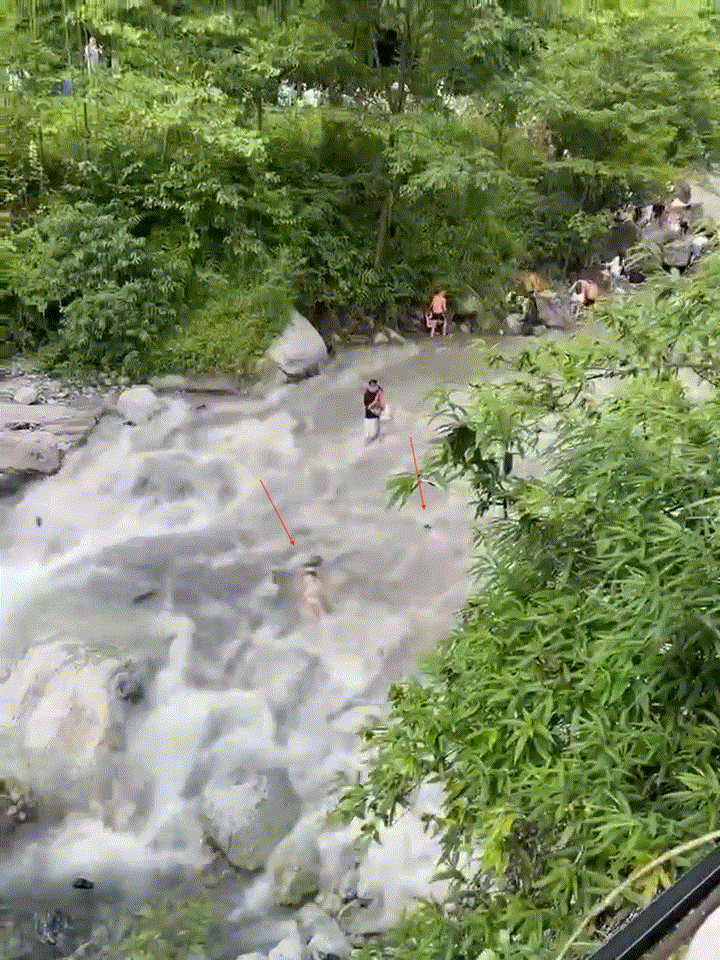
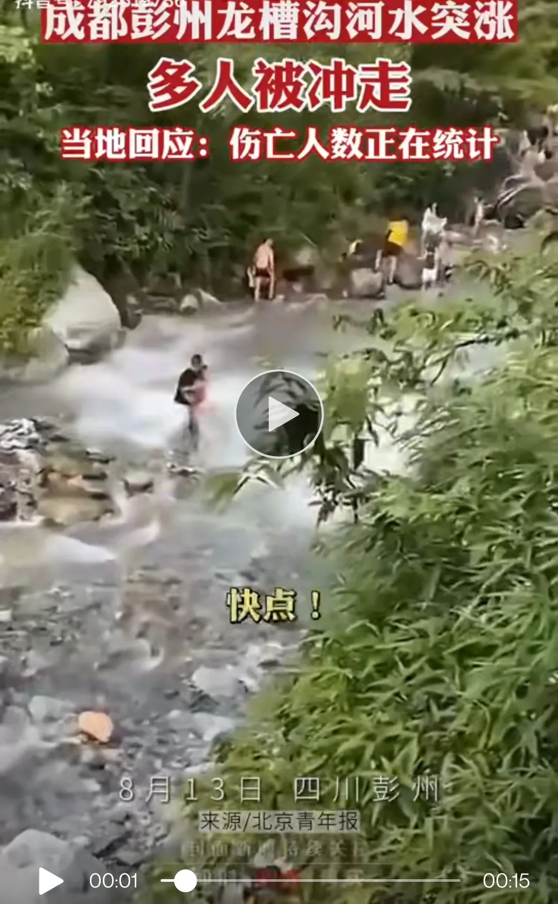
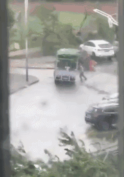
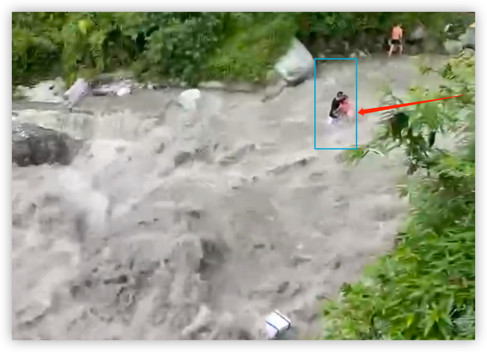
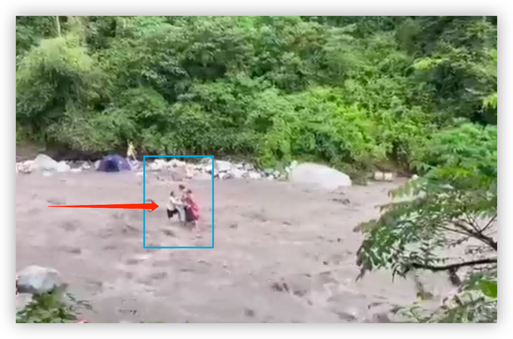

昨天，我和儿子看了一个视频，讲的是“若在野外遇到老虎，要如何做才能保命“。我们还就视频讨论了一番，并写成了文章。

有人评价，不论是视频的创作者还是我，都是”吃饱了没事之人“。我一笑置之，没有理会。

可不是么，有多少人会遇见老虎呢？居然有人费力地做成视频，告诉他人如何保命；更居然的是，还有人煞有介事地写文章分析这视频，可不是吃饱了撑的？

我理解这样的评论者，因为他们**看老虎便只见老虎**。

禅宗将人生分为三重境界：

1. 看山是山，看水是水；
2. 看山不是山，看水不是水；
3. 看山还是山，看水还是水。

我大抵位于第二重吧：看老虎不是老虎，而是看见了危险，并试图举一反三，给儿子以启发，让他从中找到方法，去面对其他的危险。

为什么第三重境界的人看老虎**还是**老虎？我不敢说知道，但我敢说的是，三重境者决计不会说我们是“吃饱了没事之人”。

哪知说到危险，这危险就来了，而且还是山水的危险。

有朋友发了一则视频，某地山洪暴发，有人被卷入洪水之中，至少两人。

的确如那朋友所言，那洪水之中一个人很明显，另一个也依稀可辨。而这河沟中乱石林立，估计是凶多吉少。我的心情一下子不好了。

我更为那对站在水中的男女而担忧，因为他们面对洪水的**姿势**不对（下文会专门讨论）。

再稍晚一点，从另一个视频中，我得知了事件的发生地，是在成都：

而另一个视频则完整展现了一个妇女被洪水卷入的全过程，更是让人难过。

我将这个过程做成了动图，从中你会清晰地看到她所犯的那些错误：

1. **对事态估计不足**。在洪水到达之前，已经有人察觉示警，大家都做出了反应，而她还在那里收拾东西。她想到达河的左侧（画面中的下方），因为收拾东西，她落在了最后。
2. **撤离方向错误**。本来她位于河的最右侧，从最右侧上岸或到达高处是最快捷的，但她偏偏舍近求远，要横穿河道。她可能是想与家人和同伴一起，却忘记了安全是第一位的。
3. **陷入了孤立无援的境地**。她因为收拾东西落在最后，但她跑得还挺快，超过了另外三人。整个来看，却成了该快的时候不快（收拾东西），而不该快的时候又快了（超过了那三人），于是，她陷入了孤立无援的境地。
4. **看重身外之物**。知道洪水将至时她顾及的是东西，而不是立即撤离；再到她独自站在那块石头上时，似乎也是因为东西被洪水冲走，她捞东西而被卷入水中的。如果不是如此，是否会撑得更久一点？

看见这被山洪卷入的妇女，我不由得想起了2017年8月台风中的一件惨事。其时，“天鸽”登陆广东中山坦洲镇，54岁的周荣为了守护自家的小货车，被压在了车底。

没有人知道周荣当时是怎么想的，但另一位50来岁的小货车司机说，看到那个视频中周荣拼命想抗住货车，他很能理解：

> 别人不会拿命去对抗台风，但周荣会，因为他靠小货车养整个家，家是他的全部，所以小货车也是他的命。

与周荣相比，那不幸落水的妇女在危急之时所收拾的东西显然不是她的身家 —— 真是让人哀叹！

还是来说说河中相依的男女吧，真的很为他们揪心，也希望他们成功上岸：

他们有一点做得很好：两人面向洪水的冲击。**糟糕却有两点**：一是不该让力量弱的女子顶在前面，二是两人站得太直，不能有效地抗洪水的冲击。

好在视频中的洪水还不算太大，否则不堪设想。若是他们没能扛住一个浪头的冲击，身体一旦失去平衡，那就再也站不住的，所以，他们应该**让力量强的男子顶在前面**，**一开始就要半蹲，降低身体重心**，同时**保持身体前倾，准备抵抗冲击**。后面的人即使力量弱，只要她伏在前面的人身上，保持住前方人的身体平衡，就能起到非常强的支撑作用。

下面这个场景中的三人，则完全没有发挥团队作用：

他们面对洪水的**站姿**与**队形**都不对。只不过由于河道变宽，水势不再那么湍急，否则，即便他们有三个人，那也将是无一幸免。他们之所能够幸存，**完全是运气**。

为什么这么说？如果被洪水所围困，我们应该如何应对？

我在之前的文章中已经提到过，就不再赘述：👉[日本科学实验：如何在洪水中生还？](https://mp.weixin.qq.com/s/GyUDKcqqY_zGWVQw-wy4ow)。（文内有视频）

我们实在不必将所有的危险都遇一次，才去想要如何应对，而是要学会从他人的经历中汲取教训，尤其是那些以生命换来的教训。

可能我们一生都不会遇见老虎……然而，我相信视频中很多人也没有料到他们这一生会遭遇山洪，也没料到这只老虎会来得如此之迅猛。但是，同样都未料到，为什么有人遭难，而有人幸存呢？

**这条河沟充满了现实的隐喻。**

一些人惊觉到洪水的到来，立刻上岸逃离；一些人被困在水中，但好在找了个高点的石头；而另则被一些人被卷入洪水之中。那些没能及时上岸的人，他们或是因为察觉较晚，或是因为动作太缓，或是因为羁绊太多，或是因为撤离的方向不对……那些遭难的人，有的是缺乏应对的措施，有的则是运气不好；而幸免于难的人，有的是应对得当，而有的人还是因为运气好。

还有一些人，**他们则根本不去这种河沟度假**，或者，**不在某个季节或时段去**。

看见这样的事情，我是难受的。这让我想起了倪匡。曾有个女记者采访他，他们有段对话大概是这样的：

> 女记者：（列举种种悲惨的事）这些都令我不开心。
> **倪匡：但你不开心于事无补。**
> 女记者：人之常情，你会有感觉。
> **倪匡：完全没用。为什么你要不开心？**
> 女记者：看见这些事情，你会否不开心？
> **倪匡：我觉得这是必然的。有A就必有B的发生。**
> 女记者：你不心痛吗？
> **倪匡**：哎呀，我该怎么说呢？**若你洞察世事，会觉得这是人类必然的事，是肯定会发生的，就像太阳下山一样，没有人会为此而伤心。**

我觉得倪匡便属于第三重境界的人，在他眼中，那老虎还是老虎。只是我现在做不到。

最后，请原谅我将那些遭遇险情的人做成了动图。我只是想将那老虎吃人的样子展现出来，鲜血淋淋地让大家看，希望有更多人能有所触动。

