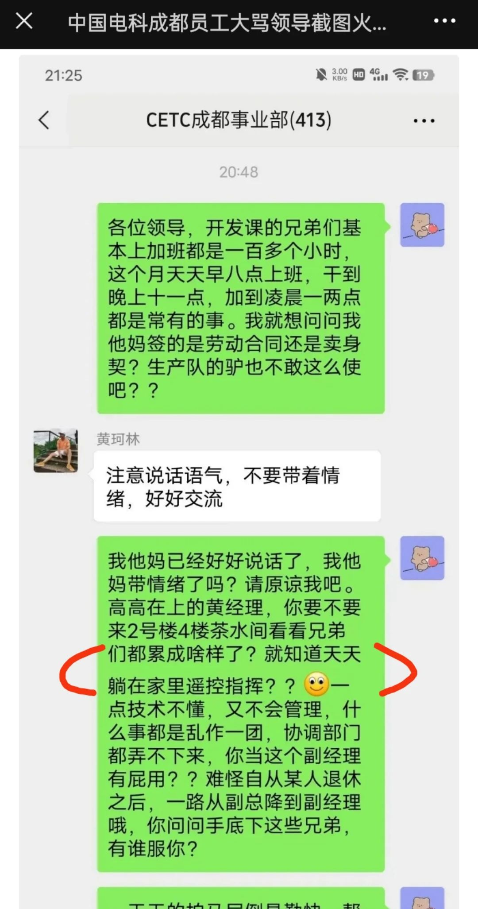
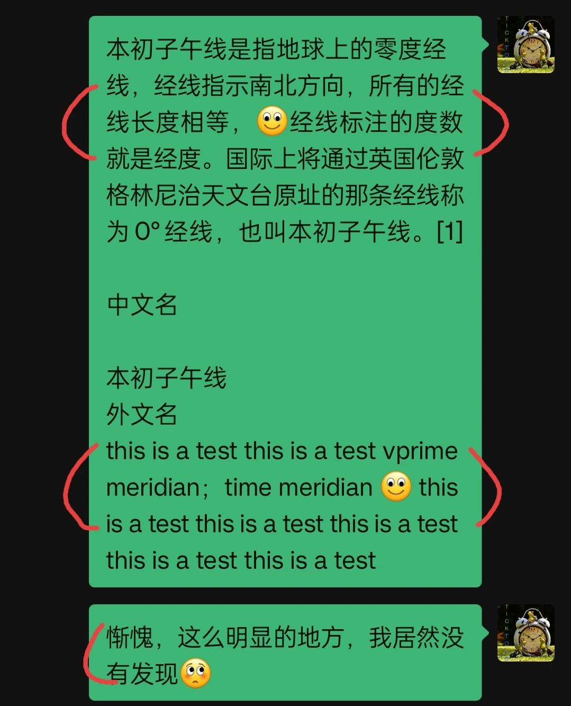

不得不说，清明节那天爆火的怼领导的聊天记录，的确是伪造的。

我本可以不趟这浑水的，但已经湿鞋了，就不得不把它烘干。

抱歉了，读了我清明节那篇文章的朋友们，我得向你们道歉 —— 我犯了个低级错误，可能误导了你们。

有网友这样评论警方的通报：

> 我也松了一口气，还以为只有我一个是怂蛋。

的确，这真是一个“好消息”。但也不免让人有些泄气，原本以为的年轻人整顿职场的壮举，终是没有发生，那依旧是飘渺的中国梦。而那常山赵子龙，依旧是演义中的传说。

更让人泄气的是，那些表示要与呐喊者共进退的同事，原来也只是人们眼中的幻相。恐怕在现实中，能有一两个人站出来支持下就已经很不错了。这依旧是我们不得不面对的现状吧。

对于警方通报的信息，我能确定的是**聊天记录是伪造的**。而只要确定了聊天记录是假的，其他的东西就无所谓了。

有一个地方特别明显：

在这张截图中，由于文字中夹杂了一个emoji的笑脸，导致了这行的排版不正常。而实际上，微信里不是这样的。

这也很好验证，你只需要在微信里面发一段带表情的文字即可：emoji表情不会导致行高或行间距异常。

有其他的文章还提到了其他证据，比如：

1. 不明显的证据：那些只有一行的表达，含有emoji表情的行比只有文字的行也要略高少许，但不仔细辨别的话，肉眼是难以发现的。
2. 佐证：好几个人的微信头像都是网络流传的人物图片。当多个同时出现时，就很可能是假的。

所以，造假者是用伪造群聊的软件炮制了这出戏，而这软件质量不咋地。当然，更不咋地的是我的表现，这么明显的异常我居然没有察觉。

惭愧之后，个人也有几点反思：

第一，在情绪高涨之时，我们的理性会被压制，会失去辨别的能力。

我一看见那篇记录聊天过程的文章便连呼过瘾，在这种无比畅快的情况下，批判性思维没能被唤起。所以，不论是大喜，大怒，还是大悲，当我们的某一情绪**暴涨**的时候，都要保持警惕，特别是那时我们需要就某事做出的判断与决定，更要特别当心。

比如，你看见了某一个极为喜爱的商品，你对孩子做的某事极为愤怒，相爱多年的恋人离开了你……

我特别记录这次的教训，就是尝试在心头设立一个“锚”，将这次的教训锚在心底。当再次情绪暴涨的时候，我期望**那个锚能将我拖出，让我警醒**。

第二，人们总是愿意相信自己愿意相信的东西。

怒怼昏庸无能的领导，那是很多人的期盼。所以，那份聊天记录符合很多人的预期，是人们强烈盼望的，也成了人们愿意相信的东西 —— 我不敢干，但终于有人这么干了！

人们总是愿意相信自己愿意相信的东西，所以，即便警方给出了通报，但依然有人不相信。当然，塔西佗陷阱也是一大原因，但是，那份聊天记录我们都能看见，我们不需要警方也可以得出结论。

不妨以此反推，我们可以得出一条基本规则：**当你得知一件你期盼已久的事发生时，你首先要怀疑它的真实性**。特别是，那事情你本来可以做，也应该做，但你却没有做，而是寄希望于别人去做，这样的事情大概率不会发生，因为别人也在等着你。

比如，若有人告诉你，政府要求所有的官员公布财产了，国家要实行全民医保了……都极可能是谣言。

第三，即便事情不是真的，但事情所折射出来的东西却是真的。

为什么那么多人都信了聊天记录？

因为聊天记录中所揭示的问题是真实存在的，而且是大面积的存在，因而得到了广泛的共鸣 —— 因共鸣得传播 —— 这恐怕是当前社会应该真正关注的问题。

辟谣易，治病难。

