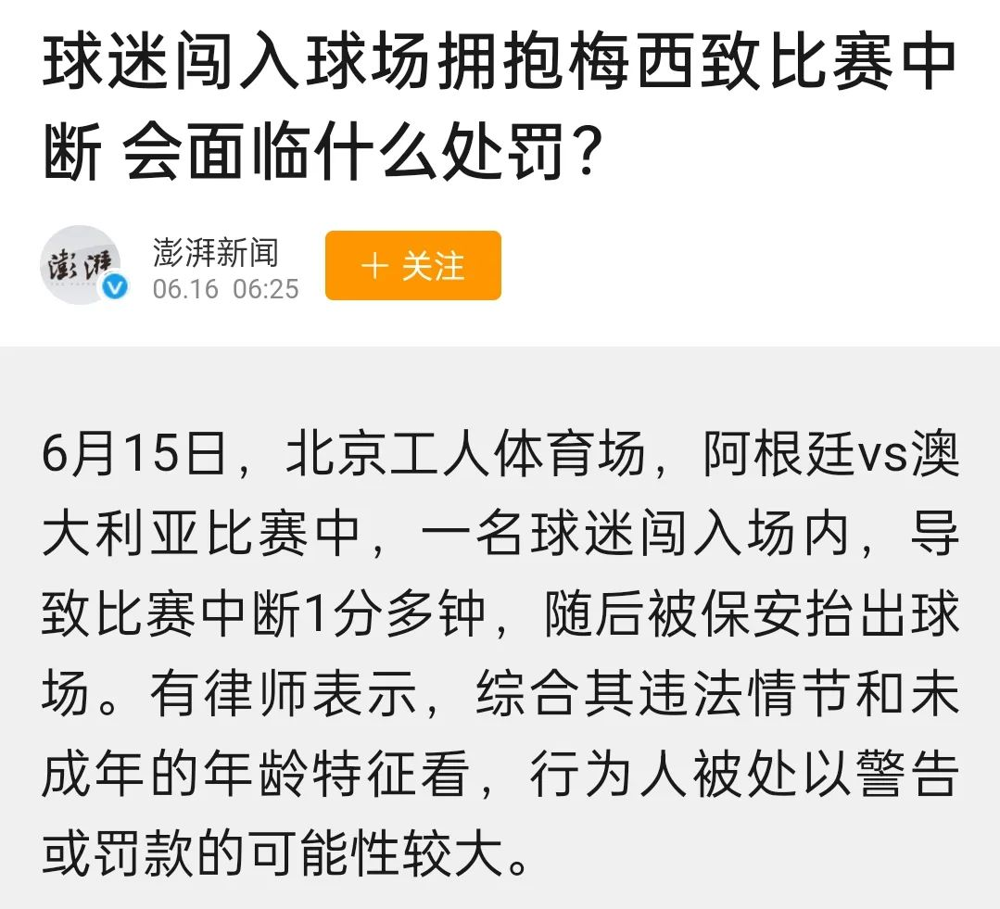

朋友圈迎来了一次狂欢，就连我这种不看足球的人都知道了。

梅西终于通过了中国的海关，于6月15日在北京工人体育馆踢起了与阿根廷队的友谊赛。这是足球迷的乐事。然而，众人不是因梅西而狂欢，是为了一个少年 —— 一个突破了围栏，跳进了足球场和梅西拥抱的少年。

与欧美那些冲进足球场的球迷不同，这个中国少年的热情中透着一丝克制，连他那稚气帅气的长相都显得有点文静，不似西方欧美的球迷那般狂热奔放（甚至是粗野）。

他在球场上和保安周旋了30来秒的样子，练了个折返跑。在被追赶的过程中，他还与站在另一端球门附近的马丁内斯击了个掌。

最终，他被保安抬出了球场。

但他在被抓以后，却是无比开心，大抵是心愿已经达成吧。

真个是，人不风流枉少年！

这种扰乱比赛的行为肯定是不好的：

微信朋友圈中的很多朋友和我一样，都是崇尚法治精神，有规则意识的，然而，对于此事，却为何是一片狂欢，甚至有的还说那少年是“昨天全中国最靓的仔”？

我没有问他们。以我个人的感受，是因为太压抑了，而这个打破束缚、冲破围栏的少年就像这炎热夏季的一场及时雨。

我初中就会背诵课本的“有法必依，违法必究”、“法律之下，人人平等”，然而，过去的三年我们经常被围困，法治精神不但没有得到体现，反而被肆意践踏。即便偶尔出现勇敢的人，依法维权，那都是凤毛麟角，昙花一现，作用及其有限。多数的人都是良（顺）民。像我这种胆小却有所期待的人，被夹杂其中，因向往法治社会而觉得困苦。所以，当看见这样勇于突破束缚的少年，我是欢欣的。

我有个大胆的推测，这少年一定不是好学生。因为好学生是不会有这种想法的，即便心头偶尔冒出这种念头，那也万万是不敢做的。

我有个邻居，他的孩子也在上小学，曾和我交流孩子学习的事，聊着聊着，他就说到想给孩子换学校，因为孩子的班主任不许孩子们下课出教室玩，上完厕所就要回教室。究其原因，是因为新学年换教室了，而校长办公室就在孩子教室的斜对面，那班主任担心孩子们太吵闹，影响到校长办公。是因为校长喜欢清静，还是班主任的刻意讨好，无从得知，但对于这种班级规定，那邻居无法接受。

试想一下，在那种环境下，只要那孩子想当个好学生，那必定是很听话的，也就绝不能出教室，更不敢在走廊上疯跑的。

当然，这个例子有点特别。但有一些更普遍的情形在学校上演。比如，孩子们放学时排队出校门，有些老师是不允许孩子们讲话的。作为成人，就拿老师来说，人们走在一起也难免说话的，更何况小孩子？人在一起便会交流，这是人之常情，是人性。下课后，放学时，那都是孩子们最放松的时候，而现如今，他们走在了一起，却是不许讲话的。当然，老师都会有很好的理由，比如是为了孩子们的安全，老师认为交头接耳会让孩子摔跤，特别是在下台阶的时候，很危险。

显然，走路时喜欢和同伴讲话的孩子不会是老师眼中的好学生。一旦成为了好学生，他们走路便是规规矩矩地一声不吭，噤若寒蝉。

所以，当这样的好学生面对球场的保安，他怎么可能会冲破重围，去拥抱心中的球星呢？恐怕连这种念头都不会有的！

那位邻居终是没给孩子换学校。但我注意到了一个变化，他家的孩子没有按照那学校的规定穿校服，通常都是穿普通的衣服，而不像别的孩子，天天都穿校服。我没有问他们不穿校服的原因，在心底里，我已经有了一个解释：当人们不得不遵守无理甚至是荒谬的规定时，这种突破规则或禁忌的心态就会在其他地方冒将出来 —— 人们需要宣泄的渠道和出口，而且，被封的地方越多，被堵得越是厉害，突破的时候便越是剧烈。

这也能解释朋友圈的狂欢。

当法治不张，本该最守法的却枉法违法，人们自是乐于看到有人打破那规矩，即便那是本应该遵守的规矩，但只要危害不大（球赛暂停几十秒），人们就会为之狂欢。

这狂欢的背后，是嘲弄，也是蔑视。

