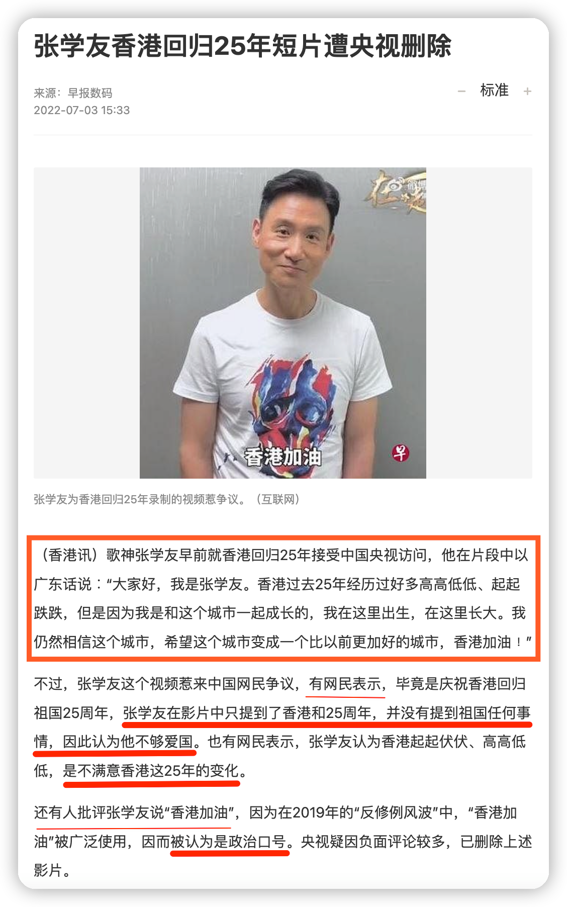
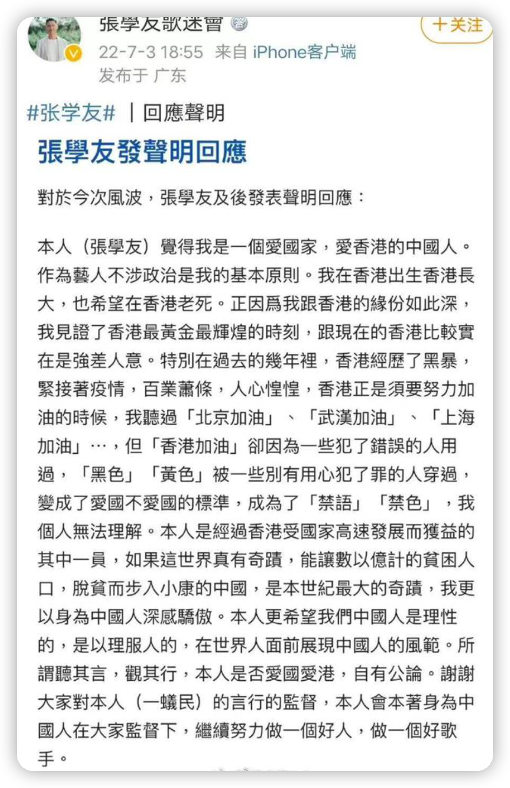
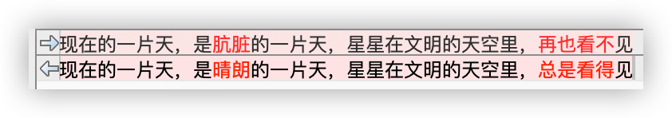

日前，张学友因为央视采访的一段讲话，被“大陆网友”痛批不爱国，不得不再次表态；郑智化的成名之作《星星点灯》，其歌词被芒果台某节目的改了，招致吐槽声一片，郑智化也对此不满。

其实，这二者的底层逻辑是一样，郑智化歌词的遭遇是张学友亲身的遭遇的初级阶段。

张学友说什么了？

张学友因为赞美不卖力，被人按在地上摩擦，只好跑出来澄清表态。这就是一代歌神的遭遇。

郑智化歌词的遭遇，让他“震惊、愤怒和遗憾”。

这是不让批评要赞美 —— 我们是解放区的天，是明朗的天，怎么可能是肮脏的天？这么明朗的天，星星自然“总是看得见”！

为什么说这二者的底层逻辑是一致的？

网上流传着这么一段话（最后有省略），您细细体会：

> 如果尖锐的批评完全消失，温和的批评将会变得刺耳。如果温和的批评也不被允许，沉默将被认为居心叵测。如果沉默也不再允许，赞扬不够卖力将是一种罪行。……

郑智化的歌词处于“温和的批评将会变得刺耳”的阶段，而张学友已经进入“沉默也不再允许”的阶段，所以，郑智化歌词的遭遇是张学友亲身的遭遇的初级阶段。

要我说呀，郑智化你就别矫情了，知足吧！

倘若张学友以后来唱《星星点灯》，歌词说不定就是这样的啦：

天不下雨，天不刮风，天上有太阳！

