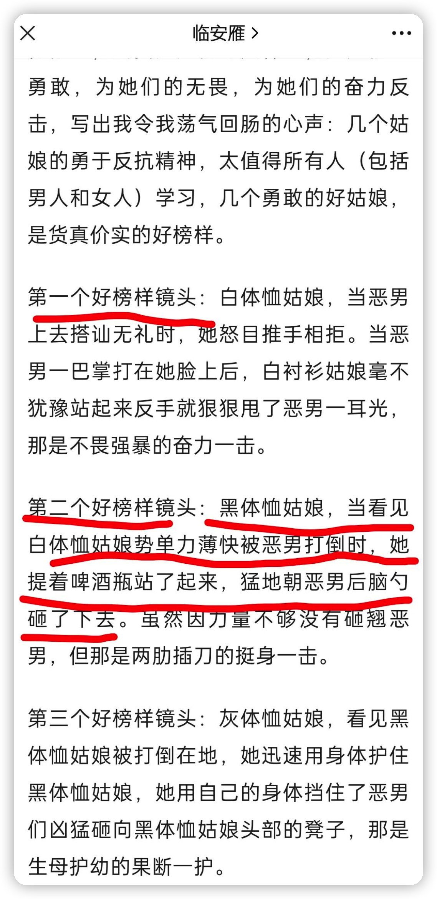
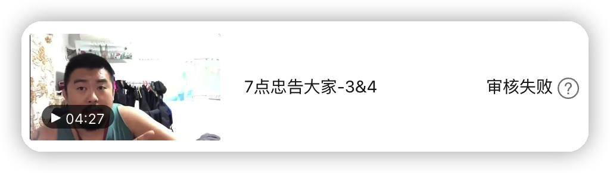

看见一篇文章，不少人点赞，但我看了有些生气，认为作者是在胡扯。

作者还枚举了那些“好榜样”的镜头：

我很想问问作者是否会以文中的**这些榜样**来教自己的孩子，如果不会，为何如此来忽悠别人？

同样的问题，我也想问问那些为文章点赞的人。估计有相当一部分人无法直视自己的内心。他们只是沉浸在“勇于反抗”、“不畏强暴”的大词里面，脑子里却被人塞进了稻草，不知不觉。

但凡看过视频的人都不会否认这一点：**双方实力悬殊，施暴者的武力完全碾压被虐者**。这也是本文所讨论话题的一个前提条件，请一定牢记这一点 —— 在我发起的此话题的讨论中，有参与者时而跳出这一限制条件，我不得不反复重申。

假设情境是这样，双方实力悬殊，施暴者具有碾压式的武力威胁，而你女儿就是那被骚扰的弱者，你会教你女儿以那几个女子为榜样来反击吗？

不妨把你女儿想象成那几个女子，**后果你也看到了** —— 如果可以重来一次，你还会鼓励她们那样做出**临场反应**吗？

有不少人认为，是暴徒找上门的，这是无妄之灾，你避无可避，也退无可退，只有奋起反抗才有生机……

曾因某事，我写过这么一段：

> 读历史时我们在读什么？
>
> 罗振宇说他曾经请教过一位历史学者，读历史读到什么程度就算入门了。那学者说，“当你不再认为谁是坏人、谁是蠢货的时候，当你能读出所有事件当事人的‘不得已’的时候，当你看到事实的复杂性的时候，就算是跨过了入门的门槛”。
>
> 作为“如何入门”的讨论，我基本持同意的态度。这是一种跨越时空的共情能力，读史人努力置身于历史人物的情境中，用当事人的视角，切身体会与思考。袁腾飞也说过这么一句：“读历史即是读人心”，更宏观一些。
>
> 入门之后呢？罗振宇并没有讲，是他们的话题到此而止，还是他没有进一步说，我不得而知。
>
> 但我难以认同：“读出所有事件当事人的‘不得已’”。如果我们事事都认为当事人“不得已”，那历史读来又有何用？我认为，“以史为鉴”，那才是读历史的意义所在。
>
> 他们就真的不得已吗？就没有其他选择？
>
> ……
>
> 而**我们现在，便活在未来的历史当中**。

6月10日凌晨，唐山发生的那一幕已经走进的历史。历史虽不能假设，但我们读那段历史，却可以来次思想实验，以这些过往为鉴，从中汲取点什么，比如，经验、教训、总结，这也是我们学习历史的意义。

那些认为“避无可避，也退无可退”便是进入了“不得已”的潜在设定。如果你依然持着这样的想法，于你而言，下面的讨论就是浪费时间，因为你已经排除了其他选项，思维是封闭的。

基于情境设定，人们很容易将自己（或女儿）代入女子的角色来思考。于共情而言，这是有好处的，但一旦带入，既定的现场画面也容易封闭思考者的其他路径，暴起反抗便成了唯一的出路。所以，我假设了一个相似的话题：

> 那换一个问题：
>
> 假设您看了一个老师暴力殴打某小学生的视频，而您也有孩子在读小学，出于担心，你会怎么教导孩子？抡起铅笔盒砸老师么？
>
> 再重申一下我的问题与情境：
>
> 你会如何教导孩子给出临场反应？在双方实力悬殊，并且对方施暴的前提下。

为什么我一再强调双方的实力悬殊，而且是弱者的临场反应？因为这直接关系到弱者的被伤害程度。弱者的反抗会招致施暴者更凶狠的攻击。

在这起事件中，希望大家注意到了暴徒踩女生头的画面。女生本已倒地，无力反抗，为什么还要踩她的头？一来是施暴者泄愤；二来这动作还有特别含义，是对弱者敢反抗进行报复，摧毁弱者的意志（人用大脑来思维，头是意志力的象征）。

在思考如何教导孩子给出临场反应的时候，不妨先确定一个原则：**力求避免孩子遭受大的伤害，伤害越小越好**。

因为有的身体伤害一旦发生是不可逆的，或者代价很高。比如，瘫痪、眼瞎。一旦受伤致残，这是事后怎么都难以找补的。

我称之为：人身伤害最小原则。这既是制定策略的原则，也是思考问题的终极目的。以此出发，下一步才是制定临场应对策略。

有道是“君子不立危墙之下”，这句话除了强调“站位”以外，还有一个意思，就是与危险保持距离。也就是说，你首先得想到的是一个字 —— 跑 —— 就像感觉到地震时的第一反应一样，撒腿就跑，跑到安全的地方。

还记得话题设定的前提么？敌强我弱，实力悬殊 —— 你很可能跑不掉的！就像事件中的女子，暴徒已经将她堵在座位上了。似乎真的没有可选项了，只剩下背水一战，抄起酒瓶子……

只能这样？就没有其他办法了？

我看了一些相关的文章，没有一个很好的答案，直至看了徐晓冬的视频。

我认为他的应对策略是最专业的：

**寻求帮助！**

因为，一，你打不过；二，你跑不过。

寻求**谁**的帮助？

首先，**寻求店家的帮助**。因为在店里发生打人事件，店家负有连带责任，所以，世界上任何一个店家都不希望店里发生这种事。

如果施暴者就是店主或店里的人，怎么办？

**哪里人多去哪里！**

因为“人多势众”，他们即使不敢出手帮忙，但也会帮拦着。徐晓冬还举了例子，比如，看见包厢里面有七八个人过生日，就一边喊“救命！有人杀人啦！”，一边冲进去扑在他们桌子上，抱住里面的人……因为他们人多，即使不敢反击，也一定会劝阻试图施暴的人。这时，你就有机会报警，有机会逃脱。

另外，徐晓冬还特别提及，让女孩练习搏击不是解决之道，那种借此事件呼吁你去学拳的都是忽悠，不值得你去学，因为一个女子再怎么厉害也打不过三四个壮汉，那不是在拳台，桌椅板凳酒瓶什么家伙都有，它们既是障碍物，也是武器，一旦饭菜酒水撒了一地，那地面也和拳台或八角笼里的不一样。

所以，**行之有效**的策略就是两条（其实是一条）：

1. 寻求帮助！
2. 哪里人多去哪里（寻求帮助）！

你看，当女子被骚扰时，抡起酒瓶开干不是唯一的选项，更不是不得已的选项。她可以和女伴们一起大喊：

“老板，救命呀！有流氓骚扰我们，救命呀！”

请注意我所建议的**呼救次序**，这是有心理学知识与逻辑支撑的：

1. **老板**：在噪杂的场所，若你在忙自己的事，会自动屏蔽周边的声音，但若有人谈到你名字，你会自动捕捉，引起你的注意。所以，第一句一定是呼叫对方的名字或称谓，引起他的注意。
2. **救命呀**：与上面道理相同，我们所有人都会对这个词汇敏感，哪怕周边嘈杂，我们也会自动捕捉到这个声音。尤其是老板，他能立刻明白你喊他不是为了上菜慢的问题。
3. **有流氓骚扰我们**：这是向所有人解释事情的原委，你是被欺负的，而对方是恶人。这是一定要交代的，让旁观者分清立场，迅速站队。
4. **救命呀**：第二个“救命呀！”不能省略，这是再次表明意图。“呼叫对象-意图-解释原委-意图”。第一个是避免他以为是普通的事，第二个是催促，这事非常紧急，赶快来！两个救命一定要大声，对暴徒形成震慑力。

重点解释第3条，这条万万不可少，也是我在复盘事件所获得的教训。我们事后看视频才知道事件发生的经过，这是“上帝视角”，要知道，事发时在场的其他人完全是懵的，他们基本都在双方打起来以后才感知到，在此之前，他们的注意力都在吃吃喝喝上，或者在同伴身上，哪里知道是这男的先骚扰女的？所以，女的必须解释原委，对方是坏人，在骚扰我！旁观者才好站在你这一方。

如果那（些）女子是这么给出临场反应的，结果会不会两样？

有的朋友可能会说，你说的这些没用，大环境不好的话，都是徒劳。我大体是同意的，这是**社会与个体**的关系。社会就像浩瀚的大海，个体是一叶扁舟。风平浪静时是难以翻船的；而一旦波涛汹涌，那翻船的几率就大大增加；若是出现滔天大浪，那所有的操舟技能都将失效，只能听天由命了。

我们一定要知道，**只有大环境变好了**，法治精神得到普遍性地落实，犯罪率才会大幅降低，**国民的安全系数才会大大提高**。而要想大环境变好，政府是关键所在。就不展开说了。

当前，我是从个体出发，探讨在波涛汹涌时如何增加生还的概率，并尽量将个体的被伤害程度降到最小。

最后，给徐晓冬的话打一个补丁：不是说练习搏击一点用没有，而是说当你面对实力远远强过你的暴徒，你反击的效用极其有限，甚至可以忽略不计。练习搏击对通常情况是有用的，比如你练得膀大腰圆的，带着女伴在外面吃饭，被人骚扰的概率也会降低。但说到通常情况，于普通人而言，还是“君子不立危墙之下”更有意义：尽量别在一些时段外出（比如深夜凌晨），尽量避免去一些冲突频发的场所（大排档、歌舞厅、夜总会等）。说到底，个人的安全与“时空”相关，**更与个人的选择强相关** —— “立”与“不立”于危墙，便是选择。

记住，当你被暴徒骚扰或威胁时，不要自己先将所有的路都堵死，认为只有抡起酒瓶这一条路，你还有选择的，首先要**寻求帮助**：

“老板，**救命呀！** 有流氓骚扰我（们），**救命呀！**”

接着：**哪里人多去哪儿！**

前车覆辙，历史可鉴。
