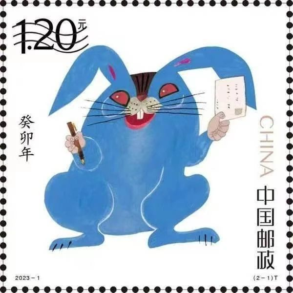
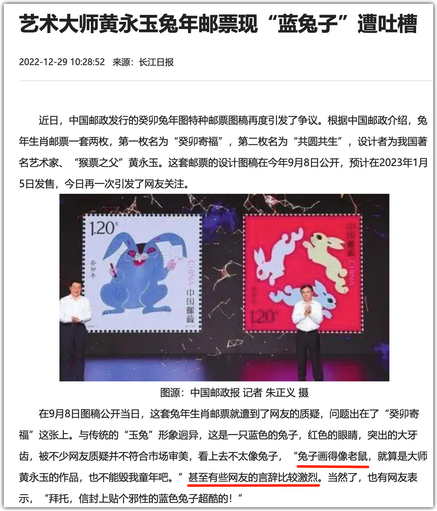

在朋友圈，看见了黄永玉先生去世的消息。一些人纷纷发文悼念。

像我这种艺术的门外汉，又是如此的孤陋寡闻，自然是与黄永玉先生不沾边的。要不是去年年底，他的那张兔年邮票被热烈讨论，我都不知这世上有他的存在。

其时，我曾想写写那张邮票，但文章开了个头就被搁置了，这一放下就不再想写，烂尾了。而今天恰好和一位老师谈及了黄永玉和他的这张邮票，就将这兔子尾巴续上。

2022年底，很多人在讨论这张邮票：

就第一观感而言，我和很多人一样，乍见这邮票就觉得不舒服。这邮票特邪性。一些网友说“有妖气”。

据以上报道，这邮票在2023年的元旦期间上市。而作为生肖邮票，在传统上它是承载着人们对新一年的期许，它应该是喜庆祥和的。然而，这蓝色的基调加上赤红的眼睛，完全与之不沾边。蓝色往往给人忧郁、消极的感觉，而红眼睛则给人邪恶感，几乎是影视中恶魔的标配。

我本也不喜欢，嗤之以鼻，但听了某播主的分享，我改变了看法，当时想写文章也是因为这改变。那播主的大意是：不是让你高兴的才叫艺术，艺术不是取悦于你的。这种丑的和邪性的东西也可以是艺术，只要是画家表达了他想表达的东西，而又能让你感受到了，那就是好的作品……

因此，当我今天看见有老师对黄永玉的大师称号不以为然，我就说了两点：有功力，很独立。（下文经过整理）

先说独立。

作为年度邮票，特别是涉及生肖这个主题，通常是喜庆为主，但黄永玉却没有随大流，而是画了一只充满了邪气的蓝兔子。

兔眼红本是正常的，但由于其脸部很像老鼠，这就使得这红眼睛目露凶光，而这兔子还很肥硕，因此，有人往“硕鼠”上解读。

总之，这只兔子不符合大众的预期，尤其是在人们期望喜庆的场合，黄永玉先生奉上了这么一件不讨喜的作品。因此，这“独立”二字的评价，黄老师是当之无愧的。

关于功力。

这就涉及到了艺术的鉴赏力，而我在这方面的认识很粗浅。（请方家多批评指正）

首先，艺术是一种表达。画画就像我们的文字和语音一样，都是人类用以表达的符号。

作为表达，即便是一个普通人说的话，也未必是能取悦你的才是好话，否则，就没什么“良言苦口”之类的说法了：马屁总是悦耳一些，而良言未必中听；独立的艺术家更是如此，不一定是取悦你的才能称之为好作品，也不一定是按人数来论，叫好、卖座的人多的就是好作品。画家首先是表达自己心中的意象，而作为表达，肯定是有（潜在）受众的，表达者也定然想引起一些人的共鸣或者更深层次的思考，这是表达的目的。

倘若人们不喜欢这只兔子（这么邪性的东西又有谁喜欢呢？），那么，我觉得黄永玉就成功了。画家表达什么呢？表达他【**对现实的理解力**】 —— 这也是我理解艺术的第二重功用。黄老师基于对现实的理解，将他对这一年的展望，浓缩在一张生肖邮票之中。

至于他画作的技法和画工，由于我不懂画，自是不能从技术方面涉及，但以风格而言，一幅画好不好，可能是萝卜青菜，各有所爱。不同绘画风格的作品，比如水彩画和山水画，怕是难分高下，不好比。

黃永玉（1924年8月9日—2023年6月13日），男，土家族，湖南凤凰人，笔名黄杏槟、黄牛、牛夫子。

是记。

